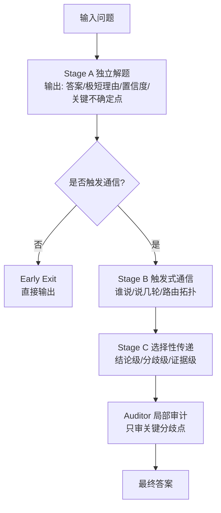
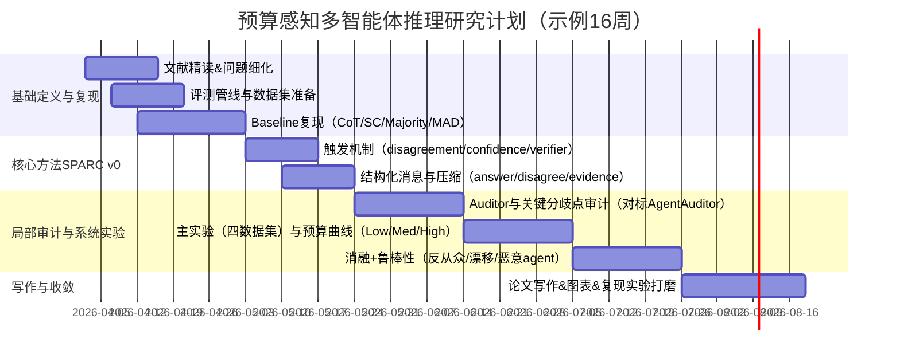

# 预算约束下的多智能体大模型推理：选择性通信与局部审计的深度综述与研究方案

## 执行摘要

你目前“导师给的研究方向”在提问中未明确给出，但你上传的材料《多智能体.docx》已经呈现出一个相对清晰、可直接开展的方向：**在固定 token/轮数/时间预算下，为多智能体（多实例/多模型）推理设计“只在必要时交流、只传必要信息、只审关键分歧”的选择性通信框架，并以局部审计替代末轮多数投票**（文稿内给出 Stage A 独立解题、Stage B 触发式通信、Stage C 选择性传递+审计的框架草案，并提出工作名 SPARC 及实验表/消融路线）。fileciteturn0file0  

围绕该方向，近五年研究脉络可以概括为：从单体推理的 CoT 与自洽采样（self-consistency）出发，到多智能体辩论（MAD）提升推理/事实性，但暴露出**通信昂贵、共识导致从众与错误传播、长对话漂移（problem drift）、裁决机制（投票/LLM-as-a-judge）偏差与不稳定**等问题；因此 2025–2026 明显涌现出“预算/效率/可靠裁决”取向的工作，例如**拍卖式通信带宽分配（DALA/AAAI 2026）、利用自信号早退与内容压缩（SID/2025）、共识自由的一轮辩论与反从众（Free-MAD/2025）、只审关键分歧点的推理树审计（AgentAuditor/2026）**等。citeturn0search3turn3search1turn0search2turn0search1  

基于这些成果与已知失败模式，本报告给出：核心概念与术语定义；权威论文与方法综述（含表格）；现有方法优缺点与关键挑战；**≥5 个可创新且可实验验证的研究问题/假设**（逐一给出数据、方法、指标、难点）；一份**可执行的 16 周研究计划**（Mermaid 甘特图）；以及**≥15 篇优先级阅读清单**（表格化要点/贡献/适用性）。citeturn2search0turn2search1turn10search2turn6search0  

## 方向澄清与核心概念

在你未明确“导师给的方向”时，最稳妥的做法是先把可能方向收敛到少数候选，然后用“关键词—交付物—目标会议/期刊—实验对象”反推导师意图；你上传的文档已高度指向其中一个方向（见下文）。fileciteturn0file0  

### 若尚未确认方向：五个高概率候选方向

1) **多智能体推理与协作机制（Multi-Agent Debate/Discussion/Peer-review）**：研究多个大模型实例如何通过讨论、互评、辩论提高推理正确率与稳健性，以及何种协作协议有效。该方向与“测试时扩展（test-time scaling）”强相关，容易对接 ACL/EMNLP/NeurIPS 等。citeturn9search0turn4search0turn0search4  

2) **预算/成本受限的多智能体通信（Communication-efficient Agents）**：把通信 token、轮数与时间当“稀缺资源”，研究何时说、谁说、说多少、对谁说，以获得最优“性能—成本”曲线（更像系统+算法结合）。代表性思路包括拍卖/竞价分配通信机会。citeturn0search3turn5search22  

3) **多智能体裁决与可验证性（Auditing / Verification / Judge reliability）**：研究如何从多条推理轨迹中做可靠裁决，避免多数投票随机性与 LLM-as-a-judge 偏差；近期出现“只审关键分歧点”的推理树审计。citeturn0search1turn6search0turn6search1  

4) **多智能体失效模式与安全（从众、说服攻击、漂移、操纵）**：系统研究“辩论为何变差”，包括从众导致正确→错误迁移、长对话漂移、以及单个智能体影响集体决策等。该方向常与可靠评测/对抗评测结合。citeturn10search0turn10search10turn10search2  

5) **面向具体应用的多智能体（检索增强、多跳问答、软件工程、评测代理等）**：强调在 QA/检索、多工具链任务中多智能体如何分工协作与评测；通常需要更强系统工程与数据管线。citeturn1search3turn5search10  

### 如何确认导师意图：一套“可操作的对齐方法”

如果你想“最快确认导师到底要你做哪一个”，建议按以下证据链（通常 1 次组会就能定）：

- **问题表述中是否出现“预算”“token/轮数/时间”“通信策略”“只在必要时交流/压缩”**：这基本锁定候选方向 2/3。你的上传文档明确出现这些关键词与三阶段框架。fileciteturn0file0  
- **导师期待的论文形态**：方法论文（提出新协议/新裁决机制） vs 分析论文（揭示失效模式） vs 系统论文（端到端平台/成本优化）。候选方向 2/3 通常对应“方法+系统化实验表+消融”。citeturn0search3turn0search1turn0search2  
- **目标会议/期刊偏好**：若导师强调 CCF-A/B 的 AI/NLP 顶会（如 AAAI/NeurIPS/ACL/EMNLP），则需把贡献表述为“新机制 + 系统实验 + 成本曲线”。citeturn5search11  
- **实验对象**：若明确是 GSM8K、MATH-500、StrategyQA、HotpotQA 这类“推理/证据型 benchmark”，更倾向候选方向 1–3；你的文档推荐了这组组合。fileciteturn0file0  

### 基于你提供材料的最可能方向与问题定义

结合《多智能体.docx》，最可能的研究方向可被严谨地定义为：

> 在给定的通信预算（token、轮数或 wall-clock time）下，设计多智能体推理协议，使系统**仅在“有价值的信息增益”时触发通信**，并**以结构化、压缩的“分歧与证据”消息替代全量推理文本**，最终通过**对关键分歧点的局部审计**产生答案，从而在保持/提升准确率的同时显著降低通信成本与错误传播风险。fileciteturn0file0  

这一定义与近作 DALA（把沟通当稀缺资源，用拍卖分配发言权）、SID（从模型自信号出发做早退与压缩）、Free-MAD（减少轮数、反从众、避免共识副作用）、AgentAuditor（只比较关键分歧点，替代投票/泛化 judge）在“问题意识”上高度一致，但你文档的核心是把它们统一到一个“触发—压缩—局部审计”的可复现实验框架中。citeturn0search3turn3search1turn0search2turn0search1  

### 核心概念与关键术语定义

- **通信预算（communication budget）**：对多智能体交互施加的资源上限，可用“总 tokens 上限 / 平均通信 tokens / 最大轮数 / 最大延迟”度量；DALA 明确把通信带宽视为稀缺资源。citeturn0search7  
- **多智能体辩论/讨论（MAD）**：多个 LLM 实例对同一问题提出答案并多轮交换理由，最后由投票或 judge 汇总；MAD 能提升推理/事实性，但也引入高 token 开销与从众风险。citeturn9search0turn0search2turn10search0  
- **触发式通信（triggered communication）**：并非默认讨论，而是当“答案不一致/置信度低/验证器认为不稳/难度估计高”等条件满足时才进入沟通；这是你文档 Stage B 的核心。fileciteturn0file0  
- **早退（early exit）**：当模型或智能体对初始答案“足够自信”时退出后续辩论，以减少冗余交互；SID 以模型级置信信号驱动早退。citeturn3search1  
- **内容压缩与“分歧焦点”（compression / disagreement focus）**：不传完整推理文本，只传结论、分歧关键步或证据；SID 进一步用 token-level semantic focus（注意力导出的争议相关片段）压缩上下文。citeturn3search0turn3search8  
- **局部审计（local auditing）**：把全局裁决转为对“关键分歧点”的局部比较/验证；AgentAuditor 用推理树显式表示一致与分歧，并聚焦决策关键节点审计。citeturn0search1turn0search5  
- **从众与错误传播（conformity / error propagation）**：辩论中智能体倾向达成一致，可能导致“正确答案被说服成错误”；Free-MAD 与 failure mode 研究都指出这是共识式 MAD 的结构性风险。citeturn0search2turn10search0  
- **问题漂移（problem drift）**：多轮讨论偏离原问题，导致性能随轮数增加反而下降；DRIFTJudge/DRIFTPolicy 专门研究并缓解该现象。citeturn10search10turn10search2  

（建议的“SPARC 三阶段最小流程”可视化如下，便于后续写论文与画方法图。）fileciteturn0file0  

## 文献综述

### 近五年研究演进脉络

单体推理的“测试时扩展”是多智能体方法的直接前史：**CoT prompting**证明“显式中间推理步骤”能显著提高复杂推理任务表现，**self-consistency**用多路径采样+一致性选择替代贪心解码，常被视作“无通信的集成基线”。citeturn2search0turn2search1  

多智能体辩论（MAD）随后被提出为可直接作用于黑盒模型的推理增强手段：经典多智能体辩论工作展示了其在数学与事实性上的收益，但也承认其 token 开销显著。citeturn9search0turn9search3 之后大量研究围绕“如何让观点更分歧、协作更像人类讨论”展开（例如强调发散思维/抑制反思退化的问题设定）。citeturn0search4turn9search21  

进入 2024–2026，研究重心明显转向“**是否真的需要多轮讨论**、**讨论增益来自哪里**、以及**如何在预算与可靠性约束下做更聪明的交互**”：有工作系统性指出强单体提示可逼近多智能体讨论上限，质疑“讨论一定是银弹”。citeturn4search7 同时，失效模式研究揭示讨论可能把正确推向错误、并引入从众与说服偏置。citeturn10search0turn10search1 针对这些问题，出现了三条与你方向高度一致的技术线：**预算化通信（拍卖/竞价）、自信号驱动的早退与压缩、以及基于分歧点的局部审计**。citeturn0search7turn3search1turn0search1  

### 代表性论文、方法与其与本方向的关系（综述表）

| 类别 | 代表工作（按时间） | 核心贡献（高度概括） | 与“选择性通信 + 局部审计”的对应关系 |
|---|---|---|---|
| 单体推理基线 | CoT prompting（2022）citeturn2search0 | 通过示例化中间推理步骤显著提升多类推理任务表现 | 你所有多智能体结果必须对比的“单体下界/强提示上界” |
| 单体测试时集成 | Self-Consistency（2022）citeturn2search1 | 多路径采样后按答案一致性选择，提高推理准确率 | 对应“无通信聚合”强基线；可作为“通信是否必要”的对照 |
| 多路径搜索式推理 | Tree of Thoughts（2023）citeturn2search2 | 以“思维单元”构树并搜索/回溯 | 提供“搜索/评估”视角：你的 Auditor 可借鉴“局部评估+剪枝”思想 |
| 多智能体辩论范式 | Multiagent Debate（Du et al., 2023/ICML 2024）citeturn9search0 | 多轮辩论提升推理与事实性，但通信昂贵 | 你的方法要回答：如何把“有效部分”保留、把“冗余成本”删掉 |
| 让辩论更发散 | Encouraging Divergent Thinking…（EMNLP 2024）citeturn0search4 | 提出 MAD 框架以缓解反思退化、鼓励不同观点 | 为“分歧触发/分歧解析”提供动机：分歧本身是价值信号 |
| 共识式多模型协作 | ReConcile（ACL 2024）citeturn2search3 | 多模型多轮讨论+置信加权投票获取更好共识 | 你的方向可在其基础上强调：**共识不等于最优**，并引入局部审计替代投票 |
| 互评协作（类学术评审） | Peer Review Collaboration（2023）citeturn4search0 | “生成—互评—修订”三阶段，强调评论与置信信息 | 与你 Stage A/B 非常接近；可借鉴“review 信息结构化”而非全量 CoT |
| 讨论是否必要的质疑 | Rethinking the Bounds…（ACL 2024）citeturn4search7 | 系统实验表明强单体提示可逼近最优讨论法 | 直接构成你的“风险点”：必须用**预算曲线/通信成本**证明贡献，而不只拼准确率 |
| 决策协议系统研究 | Voting or Consensus?（ACL 2025 Findings）citeturn4search2 | 比较多种决策协议：投票对推理类更好、共识对知识类更好等 | 支撑你把“裁决机制”作为核心变量，并设计“局部审计”替代投票/共识 |
| 共识自由的一轮辩论 | Free-MAD（2025）citeturn0search2 | 去除多轮达成共识，改用轨迹评分+反从众，降 token 并更稳健 | 为你“减少轮数/避免从众”的设计提供直接对标基线 |
| 失效模式与从众风险 | Talk Isn’t Always Cheap（2025）citeturn10search0 | 讨论可能降低准确率；模型会倾向同意而非挑战错误理由 | 强化你“只审关键分歧、限制不必要交流”的必要性 |
| 长对话漂移 | Stay Focused: Problem Drift（EACL 2026 Findings）citeturn10search10 | 定义并量化问题漂移，提出检测与缓解方法 | 你的触发机制与消息压缩应显式防漂移（限制轮数、约束话题/证据） |
| 预算化“谁说话”机制 | DALA（AAAI 2026）citeturn0search7 | 把发言机会视为拍卖，按“价值密度”竞价分配通信带宽 | 直接对应你 Stage B：**谁说/何时说**，也是最强“预算感知”类 baseline |
| 自信号驱动的早退/压缩 | SID（2025）citeturn3search1 | 从 logits/attention 提取自信号：早退 + 分歧焦点压缩 | 对应你 Stage A/B/C：早退（何时不聊）+ 压缩（聊什么） |
| 局部审计替代投票 | AgentAuditor（2026）citeturn0search1 | 构建“推理树”并只审关键分歧点，优于多数投票与 LLM-judge | 直接对应你 Stage C 的裁决：核心 baseline + 关键灵感来源 |
| LLM-as-a-Judge 与偏差 | MT-Bench/Chatbot Arena（2023）citeturn6search0；Judge综述（2026）citeturn6search1 | 系统总结 judge 偏差（位置/冗长/自增强等）与可靠性策略 | 解释为何需要“审计关键分歧点/证据驱动”的裁决，而非泛化 judge |

### 常用数据集与基准：与你文档推荐组合的合理性

你文档建议的 GSM8K、MATH-500、StrategyQA、HotpotQA 组合覆盖“算术多步推理—高难数学—隐式策略推理—多跳证据整合”，且评测指标清晰，适合量化“通信是否必要、是否节省 token、是否降低错误传播”。fileciteturn0file0  

- **GSM8K**：8.5K 小学数学文字题，用于诊断多步推理；原始工作也强调 verification 与测试时选择。citeturn1search0turn1search12  
- **MATH / MATH-500**：MATH 是竞赛数学数据集；MATH-500 常指从 MATH 测试集中选取的 500 题子集（在“Let’s Verify Step by Step/PRM800K”脉络中被广泛使用），适合评估高难推理与验证策略。citeturn1search1turn8search0turn8search3  
- **StrategyQA**：要求隐式多步策略推理的 Yes/No 问答，提供分解与证据段落，有利于评估“证据级通信”的收益。citeturn1search2turn1search6  
- **HotpotQA**：多跳问答，提供 supporting facts，天然适合测试“只交换关键证据是否足够”。citeturn1search3turn1search23  

## 技术挑战与研究问题

### 现有方法优缺点与关键挑战

**优点（为什么该方向值得做）**：  
多智能体协作确实可能带来更高的推理/事实性上限，尤其当多个智能体能提供互补视角、互相纠错时；MAD 与其变体在多个任务上展示了收益。citeturn9search0turn0search4 同时，2025–2026 的新工作表明“把预算与裁决机制当一等公民”能显著改善成本—性能权衡：例如 DALA 直接从“稀缺性”出发分配发言权，SID 用自信号减少不必要讨论，AgentAuditor 用局部审计降低投票/judge 的系统性风险。citeturn0search7turn3search1turn0search1  

**缺点/风险（为什么不容易）**：  
多智能体讨论并非总有效：强单体提示可能逼近讨论最优；讨论还可能产生从众导致的正确→错误迁移，并且多轮对话会出现问题漂移。citeturn4search7turn10search0turn10search10 此外，裁决端（多数投票或 LLM-as-a-judge）本身也存在随机性与偏差问题，judge 可靠性成为独立研究问题。citeturn4search2turn6search0turn6search1  

因此，你的研究若要“站得住”，必须把贡献落在可量化的矛盾上：  
1) **通信何时值得发生（trigger / value of information）**；2) **该传什么信息（message design / compression）**；3) **如何可靠裁决（local auditing / verification）**；并用**预算曲线**而不是单点准确率证明“更省钱、更稳、更可扩展”。citeturn0search7turn3search1turn0search1turn0search2  

### 可行且有创新性的研究问题与实验设计（至少五个）

下表给出 6 个可直接写进 proposal 的研究问题/假设，每个都可做成“方法 + 消融 + 分析”结构，并对齐你文档的实验表与消融框架。fileciteturn0file0  

| 研究问题/假设（可写成论文贡献点） | 核心想法（创新点落点） | 实验设计：数据 | 实验设计：方法与对照 | 评价指标（建议“预算曲线”必做） | 预期难点 |
|---|---|---|---|---|---|
| RQ1：**能否学习一个“通信价值”触发器**，在同等/更低 token 下达到同等准确率？ | 从手工规则（分歧/低置信）升级为可学习的触发策略：预测“继续交流的边际收益” | GSM8K、StrategyQA、HotpotQA、MATH-500 citeturn1search0turn1search2turn1search3turn8search3 | 以 Stage A 输出特征（答案分歧、logits 熵、置信分布、题面长度、检索命中等）训练分类/回归；对照：always-communicate、disagreement-trigger、confidence-threshold、DALA 拍卖发言权 citeturn0search7turn3search1 | Accuracy/EM/F1；平均通信 tokens/总 tokens；Acc per 1K tokens（你文档已建议）；不同预算下性能曲线（AUC）fileciteturn0file0 | 需要构造“通信是否带来收益”的监督信号（可用离线多次运行估计）；跨任务泛化难 |
| RQ2：**结构化消息（结论/分歧/证据三档）是否优于“传全文 CoT”**？ | 把通信空间从自由文本变为 schema，以减少漂移与冗余 | StrategyQA、HotpotQA（证据型更敏感）citeturn1search2turn1search3 | 消息三档：Answer-only；Disagreement-step；Critical-evidence；对照：全文 debate（Du et al.）、SID 的 attention 压缩、Free-MAD 一轮辩论 citeturn9search0turn3search1turn0search2 | EM/F1；证据覆盖率（supporting facts 命中）；通信压缩率；漂移率（可用 DRIFTJudge/相似度检测）citeturn10search10 | 如何自动抽取“关键分歧点/证据点”而不引入额外大开销；schema 过窄可能丢信息 |
| RQ3：**“局部审计”能否系统性优于投票与 LLM-judge**，并降低从众/错误传播？ | 把裁决从全局投票改为“推理树关键分歧点比较/剪枝”，并可结合验证器 | GSM8K、MATH-500（可验证答案）+ StrategyQA/HotpotQA（证据验证）citeturn1search0turn8search3turn1search3 | 构建 reasoning tree（对齐多条轨迹的分歧节点）；Auditor 只审关键分歧；对照：majority vote、LLM-as-judge、AgentAuditor 原方案 citeturn0search1turn6search0turn4search2 | conflict resolved%、wrong early stop%、auditor win rate（你文档建议的审计分析表）；稳健性（对抗/噪声 agent）citeturn0search1turn10search0 | 轨迹对齐与“何为关键分歧点”的定义；judge 偏差与验证器误判会影响结论 |
| RQ4：**如何把“反从众/抗说服”机制融入选择性通信**，在存在噪声或恶意 agent 时仍稳健？ | 借鉴 Free-MAD 的反从众思想与 failure mode 发现，设计对抗/反从众正则或协议 | 在四个主 benchmark 上做“注入噪声 agent/误导证据”对抗设置 citeturn0search2turn10search0 | 设置 1 个 adversarial agent（固定输出误导理由/随机证据）；比较：标准 MAD vs Free-MAD vs 你的局部审计+反从众路由 | robustness curve（错误率随恶意比例变化）；最坏情形准确率；误导检测率；额外 token 开销 | 对抗设置需公平且可复现；可能引入“安全”讨论但你主要目标仍应是推理质量/成本 |
| RQ5：**通信拓扑与路由是否应自适应（all-to-all vs star vs selective routing）**？ | 不让所有 agent 互聊；用图结构路由“把信息送到最需要的地方” | 四个 benchmark 全部适用 citeturn1search0turn1search3 | 拓扑消融：all-to-all、controller/star、pairwise challenger、选择性路由；对照 DALA（拍卖决定谁说）citeturn0search7 | 总 tokens/通信 tokens/轮数；性能；路由稀疏度；漂移率 | 图路由是组合问题，易引入实现复杂度；要保证比较公平（同预算） |
| RQ6：**能否用“预算曲线”视角做统一评价与训练/调参目标**（而非单点准确率）？ | 把研究目标改为“同等预算下更高性能 / 同等性能下更低预算”，并报告 frontier | 设定 Low/Med/High budget 三档（你文档已有表格模板）fileciteturn0file0 | 对比：vanilla MAD、DALA、SID、Free-MAD、AgentAuditor、你的方法 citeturn0search7turn3search1turn0search2turn0search1 | 性能-预算前沿（Pareto frontier）；AUC；Acc per 1K tokens；方差（多 seed） | 预算定义需与社区可比（token、轮数、wall-clock）；不同模型/推理长度会影响可比性 |

## 研究计划与时间线

### 阶段性目标与里程碑（可直接对齐论文结构）

- **Milestone A（复现与评测管线）**：在 GSM8K/StrategyQA 先跑通 Single-CoT、Self-Consistency、Majority Vote、Vanilla MAD（你的文档也建议用这条最小路线起步），确保能稳定产出“准确率 + 通信 tokens + 总 tokens + 轮数”。fileciteturn0file0 citeturn2search0turn2search1turn9search0  
- **Milestone B（SPARC v0：触发+压缩）**：实现 disagreement-trigger + answer/evidence-only 结构化消息；验证 token 显著下降且准确率不明显掉点（或在预算固定时更优）。fileciteturn0file0 citeturn3search1  
- **Milestone C（Auditor/局部审计）**：引入 reasoning tree 或“关键分歧点比较”机制，对标 AgentAuditor 与 majority vote；补齐 MATH-500 与 HotpotQA 主表。fileciteturn0file0 citeturn0search1turn8search3  
- **Milestone D（系统化 ablation + 预算曲线）**：完成触发机制、消息内容、裁决方式、拓扑、agent 数量等消融（你文档已列出完整消融清单），并用预算曲线呈现优势。fileciteturn0file0 citeturn0search7turn0search2  
- **Milestone E（写作与可复现）**：整理 failure cases（从众、漂移、错误传播），形成机制解释与可视化（通信行为分析表/分歧审计表）。fileciteturn0file0 citeturn10search10turn10search0  

### Mermaid 甘特图时间线（以 2026-04-02 起的 16 周示例）

## 风险、资源与阅读清单

### 资源与技能需求

- **算力与推理开销管理**：即使不训练模型，多智能体多轮交互也会造成显著推理成本；你的研究目标本身就是降低这部分成本，因此需要严谨日志记录“通信 tokens/总 tokens/轮数/延迟”。citeturn0search7turn3search1turn9search0  
- **实现能力**：需要搭建可插拔的“协议层”（触发器、消息 schema、路由拓扑、裁决器），并支持多种基线快速切换（你文档列出的 baseline 列表本质上就是一个可插拔实验矩阵）。fileciteturn0file0  
- **评测素养**：必须采用权威 benchmark（如 GSM8K、MATH/MATH-500、StrategyQA、HotpotQA），并使用任务领域常见指标（Acc、EM/F1），辅以预算指标。citeturn1search0turn8search3turn1search2turn1search3  
- **可靠裁决/验证知识**：若引入 LLM-as-a-judge 或 verifier，需要理解其偏差与可靠性问题，并在论文中正面处理。citeturn6search0turn6search1turn8search0  

### 主要风险与应对策略

- **风险一：多智能体增益被强单体提示“抹平”**。应对：把核心结论改写为“在预算约束下的 Pareto 改善”，报告性能—预算曲线，并强调减少冗余通信与抑制错误传播。citeturn4search7turn0search7turn0search2  
- **风险二：从众/说服导致性能下降**。应对：限制轮数、引入反从众机制、以及用局部审计替代末轮投票；并在误差分析中展示“正确→错误迁移”案例比例。citeturn10search0turn0search2turn0search1  
- **风险三：长对话漂移**。应对：把“漂移检测/避免漂移”的约束加入协议（例如强制消息必须引用题干要素或 supporting facts），并在长链任务上报告漂移率。citeturn10search10turn10search2  
- **风险四：裁决器（judge/verifier）本身不可靠或有偏差**。应对：优先使用可验证任务（数学/有 supporting facts 的 QA）；若使用 judge，需采用已知的偏差缓解实践并报告一致性；或使用“只审关键分歧点”的审计机制降低 judge 负担。citeturn6search0turn6search1turn0search1  

### 推荐阅读清单（按优先级，≥15篇，含要点/贡献/适用性）

> 说明：以下以“最直接支撑你研究方向的论文优先”，再到“更广的协作/评测/失败模式/数据集”。顶会/权威渠道参考 entity["organization","中国计算机学会","china computer federation"] 推荐目录。citeturn5search11  

| 优先级 | 文献（年份） | 要点 | 主要贡献 | 对本方向的适用性/读法建议 |
|---:|---|---|---|---|
| 1 | DALA：Cost-Effective Communication…（AAAI 2026）citeturn0search7 | 将通信视为稀缺资源，用集中拍卖决定谁说话与带宽分配 | 给出“预算化谁说话”的强基线 | 直接对标你 Stage B（触发/路由/谁说）；重点读其“价值密度/竞价信号”如何定义 |
| 2 | AgentAuditor：Auditing Multi-Agent LLM Reasoning Trees…（2026）citeturn0search1 | 用推理树表示分歧与一致，只审关键分歧点而非投票 | 提供“局部审计”范式并在多设置验证 | 直接对标你 Stage C；建议复现其“关键分歧点”构造与审计流程 |
| 3 | SID：Multi-LLM Debate Driven by Self Signals（2025）citeturn3search1 | 用模型自信号（logits/attention）驱动早退与分歧焦点压缩 | 把“何时不聊/聊什么”做成可操作机制 | 对齐你 early-exit 与压缩通信；建议关注其 token-level semantic focus 实现代价与泛化 |
| 4 | Free-MAD：Consensus-Free Multi-Agent Debate（2025）citeturn0search2 | 一轮辩论+轨迹评分+反从众，减少多轮共识副作用 | 给出“少轮数更稳健”的新基线 | 强对照：你需要说明相比它，触发+局部审计还能带来什么额外收益 |
| 5 | Talk Isn’t Always Cheap：Understanding Failure Modes…（2025）citeturn10search0 | 讨论可能降低准确率，揭示从众/说服导致正确→错误迁移 | 系统刻画失败模式 | 为论文动机与误差分析提供“必须引用”的证据来源 |
| 6 | Stay Focused：Problem Drift in Multi-Agent Debate（EACL 2026 Findings）citeturn10search10 | 定义并量化 problem drift，提出检测与缓解 | 把“长讨论变差”变为可测量问题 | 强烈建议用于你的 ablation：轮数上升时你的协议是否更抗漂移 |
| 7 | Voting or Consensus? Decision-Making…（ACL 2025 Findings）citeturn4search2 | 系统比较多种决策协议对协作效果的影响 | 证明“裁决协议本身是关键变量” | 读其实验范式，借鉴到你“裁决方式消融”与统计报告 |
| 8 | Rethinking the Bounds of LLM Reasoning…（ACL 2024）citeturn4search7 | 强单体提示可逼近讨论最优，讨论并非总必要 | 对 MAD 增益提出挑战性证据 | 用于“风险点陈述”：你的贡献应落在成本/稳健性，而不只是准确率 |
| 9 | Multiagent Debate（Du et al. 2023/ICML 2024）citeturn9search0 | 多轮辩论可提升推理与事实性，但成本高 | MAD 范式源头之一 | 作为 vanilla MAD 基线；建议复现其最小配置（3 agents/2 rounds）再做你的节省 |
| 10 | Encouraging Divergent Thinking…（EMNLP 2024）citeturn0search4 | 以“发散思维”缓解反思退化，构建 MAD 流程 | 强化“分歧有价值” | 用于合理化“分歧触发通信”的理论动机 |
| 11 | Peer Review Collaboration（2023）citeturn4search0 | 生成—互评—修订，强调评论与置信 | 类人协作协议 | 可借鉴其“review 信息结构/置信融合”，与 Stage A/B 很契合 |
| 12 | Multi-LLM Debate：Framework, Principals, and Interventions（2024）citeturn9search4 | 为多模型辩论给出理论框架与干预原则 | 提供理论/原则层解释 | 建议用于论文“理论动机”或“为什么触发/干预有效”的解释段落 |
| 13 | Judging LLM-as-a-Judge with MT-Bench & Chatbot Arena（2023）citeturn6search0 | 分析 LLM judge 偏差并提出缓解；引入 MT-bench 等 | 让“judge 也不完美”成为共识 | 你若用 judge 做漂移检测/裁决，需要引用并讨论偏差 |
| 14 | A Survey on LLM-as-a-Judge（2026）citeturn6search1 | 系统框架化 judge 可靠性问题与方法 | 给出可靠性分类与评测 | 用于你审计/裁决方法的背景与风险讨论 |
| 15 | A Survey of LLM-Driven AI Agent Communication（2025）citeturn5search22 | 系统梳理 agent 通信协议与挑战 | “通信”作为独立研究方向的综述 | 用于相关工作章节：证明“通信机制”是领域性问题，不是工程细节 |
| 16 | CoT Prompting（2022）citeturn2search0 | CoT 显著提高推理任务表现 | 单体推理基石 | 作为强单体基线与论文引言背景 |
| 17 | Self-Consistency（2022）citeturn2search1 | 多路径采样+一致性投票提高推理 | 强无通信对照 | 作为“无需通信也能提升”的关键对照，帮助论证通信增益来自何处 |
| 18 | GSM8K 数据集（2021）citeturn1search0 | 8.5K 小学数学多步推理 | 推理评测经典基准 | 你主实验数据集之一；建议对“简单题 early-exit 比例”做分析 |
| 19 | MATH 数据集（2021）citeturn1search1 | 竞赛数学难题与逐步解答 | 高难推理基准 | 用于展示“难题更需要通信/审计”；与预算曲线强相关 |
| 20 | MATH-500（来自 Let’s Verify Step by Step/PRM800K）citeturn8search3 | 常用 500 题子集，便于快速高难评测 | 标准化高难子集 | 与你文档一致，可作为主表中的“难题档” |
| 21 | StrategyQA（TACL 2021）citeturn1search2 | 隐式策略推理问答 | 检验“理由/证据交换” | 用于测试“证据级通信”是否有效 |
| 22 | HotpotQA（EMNLP 2018）citeturn1search3 | 多跳问答+supporting facts | 证据型多跳推理基准 | 用于评估“只传关键证据是否足够”与“漂移是否降低” |

（补充：你的论文若面向 AI/NLP 顶会，引用与定位可参考 entity["organization","中国计算机学会推荐国际学术会议和期刊目录","ccf conference journal list"] 的 AI/NLP 分区信息；报告中用于说明“目标会议权威性”通常足够。citeturn5search0turn5search11）