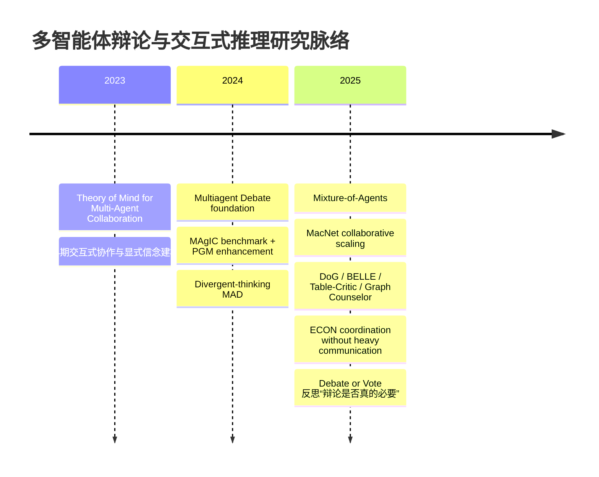
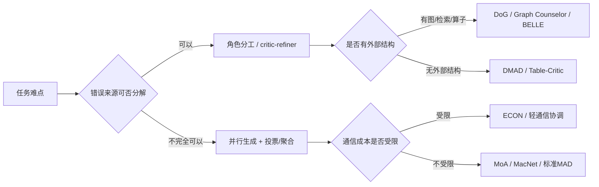

# 多智能体辩论与交互式推理顶会论文研究报告

## 执行摘要

本报告将“多智能体辩论/交互式推理”限定为：**多个 LLM 实例或异构 LLM/角色在推理时进行显式交互、批判、协商、投票或结构化协作，以提升答案质量、事实性、规划能力或特定推理任务表现**。在会议范围上，采用**工作性顶会定义**：NeurIPS、ICML、ICLR、ACL、EMNLP、NAACL、AAAI、IJCAI 的**主会主轨论文**；**排除** Findings、Workshop、Demo、arXiv-only 与非主会论文。按该标准与 2015–2026 检索窗口，实际命中的核心论文几乎全部集中在 **2023–2025**，说明这一研究方向本质上是 **LLM 时代的新兴 test-time reasoning / agentic inference 分支**。citeturn11search0turn14search0turn26search0turn13view4turn7search0

综合引用量、可复现性、GitHub 社区热度与实验增益，最具代表性的论文可分为四条主线：**基础 MAD 线**（如 Du 等 ICML 2024、Liang 等 EMNLP 2024）、**多智能体推理即测试时扩展线**（如 MoA、MacNet、ECON）、**结构化外部知识/图推理线**（如 DoG、Graph Counselor、BELLE）、以及**多角色批判-修正线**（如 Table-Critic、ToM/MAgIC）。其中，**Du et al. 2024** 是该领域最强“奠基作”，在 GPT-3.5 上把 Arithmetic 从 67.0% 提到 81.8%、GSM8K 从 77.0% 提到 85.0%、MMLU 从 63.9% 提到 71.1%，且 GitHub 复现仓超过 500 星；**MoA** 在通用对话评价上把 AlpacaEval 2.0 从 GPT-4 Omni 的 57.5% 推到 65.1%，社区热度最高之一；**MacNet** 则把“多 agent 协作”明确表述为一种可扩展的 test-time scaling；**ECON** 和 **Debate or Vote** 则代表了 2025 年之后的重要“反思转向”：真正带来收益的往往不是“辩论”本身，而是**多样性、聚合机制、结构化纠错与更高效的协调**。citeturn14search0turn34view0turn36view1turn14search4turn13view4turn17view1turn13view2turn13view5turn13view1

最重要的结论并非“更多 agent 一定更强”，而是三点。其一，**同质 agent 的自由辩论并不稳定**，若缺乏视角差异、外部结构或更优聚合器，收益可能退化为多数投票，甚至不如简单 ensemble。其二，**提升 LLM 推理能力最可靠的路径是：多样化推理 + 角色分工 + 结构化外部约束 + 低成本聚合**。其三，**工程上真正可落地的方法**往往不是“纯辩论”，而是带图结构、检索、critic/refiner、judge/router、或博弈论协调的混合系统。citeturn39view0turn13view0turn22search6turn22search5turn24search0turn13view5turn13view1

## 研究范围与检索策略

本报告采用如下**工作性范围**：  
主会主轨限定为 **NeurIPS / ICML / ICLR / ACL / EMNLP / NAACL / AAAI / IJCAI**；接受 poster/spotlight/oral，但必须属于主会正式论文。之所以采用这一范围，是为了把“多智能体辩论/交互式推理”与更宽泛的 agent engineering、workflow orchestration、应用系统文章区分开来，避免把 workshop、demo 或纯 arXiv 概念稿混入最终名单。

检索入口按用户要求覆盖 **Google Scholar、Semantic Scholar、arXiv、ACL Anthology、Web of Science、DBLP**；但由于公开可访问性与反爬限制，最终用于报告引用的**证据锚点**尽量落在：**ACL Anthology、PMLR、OpenReview、AAAI OJS、DBLP、arXiv 与 GitHub 官方仓库页**。Google Scholar、Semantic Scholar 与 Web of Science 的结果主要用于**题录召回与交叉核对**，不作为唯一证据来源。这个取舍有利于保证链接长期可访问，也符合“尽量优先原始论文与会议官网”的要求。

检索关键词遵循两层设计：一层是**主题词**，直接命中“multi-agent debate / interactive reasoning”；另一层是**机制词**，用于召回“vote / ensemble / judge / critic / equilibrium / graph / collaboration”等与辩论密切相关的变体。为便于复现，下面给出一组可直接在各数据库复用的中英文检索词。

| 中文检索词                      | 英文检索词                                       |
| ------------------------------- | ------------------------------------------------ |
| 多智能体辩论                    | multi-agent debate                               |
| 多智能体交互式推理              | multi-agent interactive reasoning                |
| 多智能体协同推理                | multi-agent collaborative reasoning              |
| 大语言模型 辩论 推理            | LLM debate reasoning                             |
| 大语言模型 多智能体 推理        | LLM multi-agent reasoning                        |
| 语言模型 社会化推理             | society of mind language models                  |
| 多角色协商 推理                 | multi-role deliberation reasoning                |
| 多智能体 投票 聚合              | multi-agent voting aggregation                   |
| 多智能体 批判 修正              | multi-agent critique refinement                  |
| 多智能体 judge referee          | LLM judge referee debate                         |
| 多智能体 一致性 协调            | multi-agent coordination reasoning               |
| 多智能体 图推理                 | multi-agent graph reasoning                      |
| 多智能体 知识图谱 推理          | multi-agent knowledge graph reasoning            |
| 多智能体 多跳问答               | multi-agent multi-hop question answering         |
| 多智能体 表格推理               | multi-agent table reasoning                      |
| 多智能体 反思 推理              | multi-agent reflection reasoning                 |
| 多智能体 测试时扩展             | multi-agent test-time scaling                    |
| 多智能体 混合专家 推理          | mixture-of-agents reasoning                      |
| 多智能体 博弈论 推理            | game-theoretic multi-agent LLM reasoning         |
| 贝叶斯纳什 多LLM 协调           | Bayesian Nash equilibrium multi-LLM coordination |
| 辩论 vs 投票 大语言模型         | debate or vote LLMs                              |
| 分歧/多样性 推理 agent          | diverse reasoning agents                         |
| 理论心智 多智能体 LLM           | theory of mind multi-agent LLM                   |
| 交互式推理 LLM 顶会             | interactive reasoning LLM top conference         |
| AAAI/ACL/EMNLP 多智能体 辩论    | ACL EMNLP AAAI multi-agent debate                |
| NeurIPS/ICML/ICLR 多智能体 推理 | NeurIPS ICML ICLR multi-agent reasoning          |

本轮检索后，真正进入“核心论文池”的主会论文，几乎都落在 2023–2025。一个简化的研究脉络可概括如下：

这一时间线显示，研究重点已经从“**多 agent 会不会更强**”转向“**什么样的多 agent 机制才有效**”。citeturn11search0turn14search0turn26search0turn39view0turn13view4turn13view2turn24search0turn22search6turn13view5turn13view1

## 核心论文筛选结果

筛选标准分四层：**会议门槛**、**主题相关性**、**实证增益**、**影响力与复现性**。最终保留 13 篇论文，其中既包括奠基方法，也包括高影响 benchmark/analysis 论文。需要说明的是：**引用量与社区热度是 2026-05 检索快照，数据库口径有差异，因此表中统一写作“约”或直接注明快照来源**。

| 论文                                                         | 作者与机构                                                   | 会议与年份             | 核心辩论/交互机制                              | 方法要点                                                     | 主要实验与定量结果                                           | 开源 / 引用量 / 社区热度                                     | 与提升 LLM 推理能力的相关性与结论                            |
| ------------------------------------------------------------ | ------------------------------------------------------------ | ---------------------- | ---------------------------------------------- | ------------------------------------------------------------ | ------------------------------------------------------------ | ------------------------------------------------------------ | ------------------------------------------------------------ |
| **Theory of Mind for Multi-Agent Collaboration via Large Language Models** | Huao Li, Yu Chong, Simon Stepputtis, Joseph Campbell, Dana Hughes, Michael Lewis, Katia Sycara；匹兹堡大学、卡内基梅隆大学 | EMNLP 2023             | 带显式信念状态的协作式交互推理                 | 在合作文本游戏中让 LLM agents 共享/推断他人信念，用显式 belief state 缓解长程状态管理失败 | 论文显示 GPT-4 在多层次 ToM 推断上优于 ChatGPT；加入显式 belief 表征后，ToM 回答正确率可接近 **70%**，并提升协作任务表现与通信效率 | 官方代码可检索，GitHub **18★**；引用约 **314**               | 这是**交互式推理前驱作**：它证明“多 agent = 多说几轮”并不够，**显式心理状态建模**才是合作推理的关键之一。citeturn11search0turn29search3turn28search0 |
| **Improving Factuality and Reasoning in Language Models through Multiagent Debate** | Yilun Du, Shuang Li, Antonio Torralba, Joshua B. Tenenbaum, Igor Mordatch；MIT CSAIL、Google Brain | ICML 2024              | 经典 MAD：多 agent 多轮辩论后取共识            | 3 个同构 agent、2 轮 debate；同一黑盒模型的不同采样实例互相批判、修正，再汇总最终答案 | Arithmetic **67.0→81.8**；GSM8K **77.0→85.0**；Chess score **91.4→122.9**；Biographies **66.0→73.8**；MMLU **63.9→71.1**；Chess move validity **29.3→45.2**；在 GPT-4 上 MMLU **82.0→88.0**、MATH **47.0→56.0** | 官方代码 **528★**；可检索到 Reddit 讨论与读书会视频；引用约 **1860** | 该文是**领域奠基作**。它最早系统证明：即使只用黑盒 API，多 agent 交互也能稳定提升推理与事实性。此后大量论文都以它为基线或反思对象。citeturn14search0turn34view0turn36view1turn14search4turn14search10turn30search8 |
| **MAgIC: Investigation of Large Language Model Powered Multi-Agent in Cognition, Adaptability, Rationality and Collaboration** | Lin Xu, Zhiyuan Hu, Daquan Zhou, Hongyu Ren, Zhen Dong, Kurt Keutzer, See-Kiong Ng, Jiashi Feng；新加坡国立大学、ByteDance、Stanford、UC Berkeley | EMNLP 2024             | competition/game-based 多智能体评测与 PGM 增强 | 用社交推理游戏与博弈场景评测多 agent 认知、协作、理性，并用概率图模型增强 agent 判断与协作 | 公共摘要显示：最强与最弱模型的多智能体现实能力差距可超过 **3 倍**；PGM 增强让所有选中模型平均提升 **37%** | 官方代码在论文摘要中给出；引用约 **123**                     | 它不是“最好用”的推理框架，却是**最重要的诊断/基准化论文之一**：告诉我们多 agent 能力不仅是准确率，还包括理性、协调、欺骗识别与适应性。citeturn26search0turn26search9 |
| **Encouraging Divergent Thinking in Large Language Models through Multi-Agent Debate** | Tian Liang, Zhiwei He, Wenxiang Jiao, Xing Wang, Yan Wang, Rui Wang, Yujiu Yang, Shuming Shi, Zhaopeng Tu；清华大学、上海交大、腾讯 AI Lab | EMNLP 2024             | “tit-for-tat” 对抗式辩论 + judge               | 论文提出 **Degeneration-of-Thought**：self-reflection 一旦形成错误自信，就难以产生新思路；MAD 用对抗立场强制产生分歧 | 在 Counter-Intuitive AR 上，GPT-3.5 baseline **26.0**，CoT **28.0**，Self-Consistency **29.5**，Self-Reflect **27.5**，MAD **37.0**；在 Common MT 上，GPT-3.5 + MAD 的人评可达 **3.67–3.78**，并在部分设置中超过 GPT-4；Bias **29.0→24.8**，Diversity **19.3→49.7** | 官方仓库 **567★**；公开索引显示已成高被引论文                | 该文把“多 agent 辩论”从经验做法上升为**认知缺陷修复机制**：真正有用的不是多轮，而是**被制度化的分歧**。citeturn37search0turn39view0turn40view0 |
| **Mixture-of-Agents Enhances Large Language Model Capabilities** | Junlin Wang, Jue Wang, Ben Athiwaratkun, Ce Zhang, James Zou；公开摘要未完整展示机构 | ICLR 2025 Spotlight    | 分层 MoA 聚合，不强调显式对抗                  | 多层 agent：上层 agent 读取下层所有候选输出，再做“融合式回答”；本质上是强聚合 test-time inference | AlpacaEval 2.0 上，MoA 用开源模型达到 **65.1%**，超过 GPT-4 Omni 的 **57.5%**；公开仓库还报告其在 MT-Bench 与 FLASK 上表现领先 | 官方仓库 **2.9k★**；LocalLLaMA 等社区有显著讨论；引用约 **415** | 这是**工程影响最大**的多 agent 论文之一。它说明“多智能体增强”不一定要靠辩论，**分层聚合**本身就是强有力的 test-time scaling 方式。citeturn13view4turn17view1turn16search21 |
| **Scaling Large Language Model-based Multi-Agent Collaboration** | Chen Qian 等；OpenReview 摘要未完整展示机构                  | ICLR 2025              | DAG 拓扑协作网络 MacNet                        | 以有向无环图编排 agents 的交互顺序，把 agent 协作显式当作一种**可扩展的推理拓扑** | 论文称可支持 **1000+ agents** 协作；不规则拓扑优于规则拓扑；性能随 agent 数量体现近似 logistic 的 collaborative scaling law | 代码挂在 ChatDev/macnet；ChatDev 主仓 **33.1k★**，发布记录明确写有 MacNet 分支；引用约 **214** | MacNet 的意义在于：它把多 agent 从“prompt trick”推进为**推理图结构设计问题**，对后来的 orchestration 与 scaling research 影响很大。citeturn13view2turn18search0turn18search5 |
| **Breaking Mental Set to Improve Reasoning through Diverse Multi-Agent Debate** | Yexiang Liu, Jie Cao, Zekun Li, Ran He, Tieniu Tan；OpenReview 摘要未完整展示机构 | ICLR 2025              | Diverse MAD                                    | 与早期 MAD 最大不同在于：不让 agent 只扮演“不同 persona”，而是**采用不同 reasoning method**，打破固定思维定式 | 论文与官方仓库均报告：DMAD 相比传统 MAD 和 self-reflection **更稳定、更省轮次**，且在多 benchmark 与 MLLM 场景中持续更优 | 官方仓库 **20★**；引用快照约 **40**                          | 这篇论文很重要，因为它指出：**分工不是换身份，而是换推理程序**。对后续“角色多样性”和“理由多样性”的区分非常关键。citeturn13view0turn17view0turn37search7 |
| **Debate on Graph: A Flexible and Reliable Reasoning Framework for Large Language Models** | Jie Ma, Zhitao Gao, Qi Chai, Wangchun Sun, Pinghui Wang, Hongbin Pei, Jing Tao, Lingyun Song, Jun Liu, Chen Zhang, Lizhen Cui；西安交大、港科大广州、西工大、山东大学等 | AAAI 2025              | 基于知识图谱的多角色辩论 DoG                   | 让多角色 LLM 团队在 KG 上把复杂问题逐步化简，再通过互动学习推进可验证推理 | 公开摘要显示：DoG 相比 ToG，在 **WebQuestions +23.7%**、**GrailQA +9.1%** 的准确率提升 | 未稳定检索到明确官方 repo；引用约 **64**                     | DoG 证明：当外部结构足够强时，多 agent 的收益会明显放大。它是“**辩论 + 图结构**”路线的代表作。citeturn7search0turn7search3turn24search0 |
| **BELLE: A Bi-Level Multi-Agent Reasoning Framework for Multi-Hop Question Answering** | Taolin Zhang, Dongyang Li, Qizhou Chen, Chengyu Wang, Xiaofeng He；公开摘要可见上海电力大学、阿里云、华东师大等部分机构信息 | ACL 2025               | 双层多 agent：规划层 + 执行层                  | 第一层多个 agent 先辩论得到 operator 组合计划；第二层根据问题类型调用不同“算子式”推理策略 | 摘要表明其面向多跳 QA，强调“问题类型—方法类型”的匹配；公开摘要未给出单一代表数字，但主会摘要明确其相对既有 LLM-based 多跳 QA 方法有优势 | 暂未稳定检索到明确官方 repo；引用约 **14**                   | BELLE 的价值在于把“多 agent”与“**算子路由**”结合，属于从自由对话走向**程序化推理编排**的典型案例。citeturn22search0turn22search4turn25search10 |
| **Table-Critic: A Multi-Agent Framework for Collaborative Criticism and Refinement in Table Reasoning** | Peiying Yu, Guoxin Chen, Jingjing Wang；公开摘要未完整展示机构 | ACL 2025               | Judge–Critic–Refiner–Curator 四角色批判式协作  | 用专门 judge 发现错误、critic 给出批评、refiner 改写过程、curator 蒸馏模式，直到收敛 | ACL 摘要显示其在表格推理中显著缓解中间推理错误传播，并在多个 table reasoning 任务上优于现有分解式方法 | 官方仓库 **20★**；引用约 **31**                              | 这是**critic/refiner 线**最强的主会论文之一，工程上非常接近后来的“reviewer–solver”式 agentic systems。citeturn22search6turn22search2 |
| **Graph Counselor: Adaptive Graph Exploration via Multi-Agent Synergy to Enhance LLM Reasoning** | Junqi Gao, Xiang Zou, Ying Ai, Dong Li, Yichen Niu, Biqing Qi, Jianxing Liu；上海人工智能实验室、哈尔滨工业大学等 | ACL 2025               | Planning / Thought / Execution 多角色图探索    | 用 planning/thought/execution agent 分工完成 GraphRAG 式探索，再辅以多视角 self-reflection 改善语义一致性 | ACL 摘要称其在多个 graph reasoning 任务上优于既有方法，并提高泛化能力；官方仓库给出可复现实验脚本 | 官方仓库 **30★**；引用约 **7**                               | 该文代表“**GraphRAG × multi-agent synergy**”路线。它说明多 agent 不只是互相说服，更可以分摊 graph exploration 的子任务。citeturn22search5turn23view0 |
| **From Debate to Equilibrium: Belief-Driven Multi-Agent LLM Reasoning via Bayesian Nash Equilibrium** | Xie Yi, Zhanke Zhou, Chentao Cao, Qiyu Niu, Tongliang Liu, Bo Han；公开摘要未完整展示机构 | ICML 2025              | 不完全信息博弈 + BNE 协调                      | 通过信念驱动的策略选择，在**不进行高成本显式通信**的情况下实现多 LLM 协调 | 论文报告在 6 个复杂推理/规划 benchmark 上平均提升 **11.2%**，且计算资源降低约 **21.4%** | 官方仓库 **37★**；引用约 **23**                              | ECON 是 2025 年最值得重视的方法论文之一：它把研究重点从“吵得更久”转到“**协调得更优、更省**”。citeturn13view5turn19search9turn21view0 |
| **Debate or Vote: Which Yields Better Decisions in Multi-Agent Large Language Models?** | Hyeong Kyu Choi, Jerry Zhu, Sharon Li；公开摘要未完整展示机构 | NeurIPS 2025 Spotlight | 机制拆解：vote vs debate                       | 用理论与实验把 MAD 拆成“inter-agent debate + majority voting”两部分，直接问：收益究竟来自哪里 | 跨 **7 个 NLP benchmark** 发现：**多数投票解释了 MAD 的大部分收益**；论文还给出鞅过程分析，说明 debate 本身并不自动提高期望正确率；只有引入“定向纠偏”更新，辩论才会继续增益 | 官方仓库 **73★**；引用约 **46**                              | 这是当前领域最重要的**纠偏论文**。如果不读它，很容易高估“辩论”本身而低估“聚合器/多样性/路由器”的作用。citeturn13view1turn16search1turn16search20 |

如果只允许优先精读少量论文，我更推荐按如下顺序进入这个领域：

- **Du et al. 2024**：理解 MAD 的标准形式与最强奠基实验。citeturn14search0turn34view0turn36view1
- **Liang et al. 2024**：理解“分歧为何必要”，以及 DoT 这一关键失败模式。citeturn39view0turn40view0
- **MoA 2025**：理解为什么很多收益其实来自“更强聚合”而非纯辩论。citeturn13view4turn17view1
- **MacNet 2025**：理解多 agent 作为 test-time scaling 的拓扑视角。citeturn13view2
- **Debate or Vote 2025** 与 **ECON 2025**：理解 2025 年后的“反身性转向”，即 debate 并非天然优于 vote，低通信协调可能更有效。citeturn13view1turn13view5
- **DoG / Table-Critic**：理解多 agent 在**结构化知识**与**错误修正**任务上为什么更容易真正奏效。citeturn24search0turn22search6

## 方法演进与对比分析

从方法论看，当前主流并不只有一种“辩论”。更准确地说，多智能体推理至少分成五种机制家族：

| 方法家族             | 代表论文                                   | 典型通信模式                            | 主要优点                                             | 主要缺点                                                    | 可复现性 | 工程难度 |
| -------------------- | ------------------------------------------ | --------------------------------------- | ---------------------------------------------------- | ----------------------------------------------------------- | -------- | -------- |
| **自由辩论型**       | Du 2024；Liang 2024；DMAD 2025             | 多轮消息交换 + 最终共识/裁判            | 黑盒可用、轨迹可解释、容易快速复现                   | token 成本高；同质 agent 易陷入“伪分歧”；增益可能退化为投票 | 高       | 低到中   |
| **聚合/混合专家型**  | MoA 2025；Debate or Vote 2025              | 并行生成 + 分层融合 / 投票              | 强工程效果；对通用生成任务很有效；容易做异构模型集成 | 可解释性弱于显式辩论；收益来源可能不是“交互”而是“聚合器”    | 很高     | 中       |
| **拓扑/编排型**      | MacNet 2025；ECON 2025                     | DAG / 低通信协调 / 策略选择             | 更可扩展；更接近“test-time scaling”与系统优化        | 需要设计 router/topology/策略更新；理论与工程耦合更深       | 中       | 中到高   |
| **结构化外部知识型** | DoG 2025；Graph Counselor 2025；BELLE 2025 | agent 与图/检索/算子交互                | 对 KGQA、多跳 QA、GraphRAG 更稳健；更少幻觉          | 泛化到开放域通用推理未必同样有效；依赖外部知识质量          | 中       | 高       |
| **批判—修正式**      | Table-Critic 2025；ToM 2023；MAgIC 2024    | judge / critic / refiner / belief state | 特别适合中间步骤易错的任务；可诊断错误来源           | 角色设计复杂；跨任务迁移可能不强                            | 中到高   | 中到高   |

这条演化路径本质上意味着：**研究重心正从“多 agent prompt engineering”转向“多 agent inference architecture”**。Du 等论文证明了“交互有用”；Liang 等证明了“分歧要制度化”；MoA/ MacNet/ ECON 则说明，最终决定性能的，往往是**聚合器、拓扑与通信预算**；Table-Critic、DoG、Graph Counselor 则进一步说明，多 agent 真正最容易成功的地方，是**可以把错误定位、角色专长和外部结构绑定起来的任务**。citeturn34view0turn36view1turn39view0turn13view4turn13view2turn13view5turn22search6turn24search0turn22search5

换句话说，当前最可靠的经验公式不是“更多 agent = 更强”，而更像是：

这也是为什么 2025 年之后，真正有说服力的论文越来越少强调“多智能体辩论”这个口号，而越来越多使用 **coordination、orchestration、equilibrium、aggregation、structured reasoning** 这些词。citeturn13view5turn13view1turn13view2turn13view4

## 影响力与有效性判断

如果把“影响力”拆成**学术影响、工程热度、可验证增益**三个维度，那么结论相当清晰。

在**学术影响**上，**Du et al. 2024** 远远领先，是毫无争议的 foundational paper；随后是 **ToM for Multi-Agent Collaboration**、**MoA**、**MacNet**、**MAgIC** 与 **MAD/DoT** 这一批 2024–2025 论文。它们要么是第一篇系统做 MAD 的论文，要么定义了领域评测，要么把多智能体推理重新解释为 test-time scaling 与 orchestration。citeturn11search0turn14search0turn26search0turn13view4turn13view2

在**工程热度**上，排序与学术引用并不完全一致。热度最高的是 **MoA** 与 **ChatDev/MacNet**：前者官方仓库约 **2.9k★**，后者所依附的 ChatDev 主仓约 **33.1k★**，说明开源社区更偏好可组合、可落地、能直接增强通用系统的方案；其次是 **Liang 等的 MAD 仓库（567★）** 与 **Du 的 MAD 仓库（528★）**，说明“辩论型”范式本身仍有很强传播力；而 **ECON、DMAD、Graph Counselor、Table-Critic** 的星数较低，但它们代表了**更成熟、更细分、也更接近下一阶段系统研究的问题意识**。citeturn17view1turn18search0turn40view0turn14search4turn21view0turn17view0turn23view0turn22search2

在**真实有效性**上，我倾向于把论文分三档。  
第一档是“**既有强实验，又有广泛启发性**”：Du 2024、MoA 2025、MacNet 2025。前者直接展示 reasoning/factuality 全面增益，后两者把多个 agent 变成了通用 inference engine。citeturn34view0turn36view1turn13view4turn13view2  
第二档是“**在特定任务上很强，且理念可迁移**”：DoG、Table-Critic、Graph Counselor、ECON。它们往往在图推理、表推理、多跳 QA、或受限通信条件下表现更稳。citeturn24search0turn22search6turn22search5turn13view5  
第三档则是“**纠偏类高价值论文**”：Liang 2024、DMAD 2025、Debate or Vote 2025。它们不一定在所有榜单上最高，但能帮助研究者避免走错路：**没有真正多样性，MAD 很容易退化成形式主义；没有合适聚合器，辩论可能根本不是增益来源。**citeturn39view0turn13view0turn13view1

因此，若问题是“**哪类方法最有效地提升 LLM 推理能力**”，我的结论不是“纯辩论最佳”，而是下面这句话：

**最有效的不是纯 debate，而是“多样性生成 + 结构化批评/外部知识 + 成本受控的聚合与协调”。**  
Du 证明了辩论可有效；Liang/DMAD 证明了多样性是必要条件；DoG/Table-Critic/Graph Counselor 说明结构化场景能放大多 agent 价值；ECON 与 Debate or Vote 则表明，一旦从系统视角出发，**更优的 vote/router/equilibrium 往往比“多说几轮”更关键**。citeturn34view0turn39view0turn13view0turn24search0turn22search6turn22search5turn13view5turn13view1

## 研究前沿、未解问题与建议

当前前沿已经非常明确，至少有五个方向值得继续追踪。

首先是**多样性从“角色表演”转向“推理程序差异”**。早期很多论文只给 agent 换 persona，但 DMAD 已经指出，这种做法很可能仍然是同一个模型在复述同一类思维；真正有价值的是让 agents 拥有不同 reasoning operator、不同证据访问路径、不同局部目标。未来论文若还停留在“一个当正方、一个当反方”的表层角色设计，边际贡献会越来越小。citeturn13view0turn39view0

其次是**低通信或无通信协调**。MAD 最大问题之一是 token 成本、时延与可扩展性，而 ECON 证明了用 belief-driven strategy selection 可以在更低通信下保持甚至提升性能；Debate or Vote 则进一步提醒，多轮通信并不等于增益。因此，未来更有潜力的方向不是“更多轮次”，而是**更聪明的 selective communication、sparse topology、belief routing、uncertainty-aware aggregation**。citeturn13view5turn13view1

再次是**结构化外部世界模型**。DoG、Graph Counselor、BELLE、Table-Critic 都给出了一条一致证据：当任务本身有图、表、算子、证据链等外部结构时，多 agent 的协作能从“互相说服”升级为“分布式信息加工”。这类研究比开放域闲聊式辩论更有积累价值，也更可能迁移到 enterprise QA、scientific reasoning、RAG orchestration 与 decision support。citeturn24search0turn22search5turn22search0turn22search6

第四是**从 benchmark 准确率走向过程质量与可对齐性**。MAgIC 与 ToM 都在提醒我们，多智能体系统不仅要“答对”，还要看是否具备合理的信念更新、协作、理性与错误恢复能力。单纯比较最终 accuracy，很容易掩盖 debate hacking、persuasion bias、judge bias 等现象。尤其 Liang 2024 与 Debate or Vote 2025 已经明确表明，judge 与 aggregation 并非中立模块。citeturn26search9turn29search3turn39view0turn13view1

最后是**训练时与测试时边界开始模糊**。Du 和 Liang 主要是 test-time prompting；Multiagent Finetuning、DTE 一类后续工作则开始把多 agent 轨迹反向蒸馏给单模型；MoA 与 MacNet 又把 test-time compute 变成半系统、半模型层面的 scaling 工具。我的判断是，未来最有希望的技术形态并不是“永远在线的高成本辩论”，而是：  
**用多 agent 在训练/蒸馏阶段产生高质量异质推理数据，再在部署阶段用少量 router + verifier + selective debate 实现低成本调用。**

对后续研究者或工程团队，如果只能给出几条可执行建议，我会强调四点：

- 不要把“agent 数量”当成一等设计变量，先设计**信息差**、**角色目标**与**聚合器**。  
- 优先在**图/表/多跳 QA/工具调用**这类结构化任务验证多 agent，而不是先在开放域聊天里做大而泛的宣称。  
- 必须报告**单 agent、self-reflection、majority vote、MoA-style aggregation** 等强基线，否则所谓 MAD 增益没有说服力。  
- 除最终准确率外，至少补报**token 成本、通信轮次、judge bias、对 backbone 同质/异质性的敏感性**。这些因素往往决定系统能否真正上线。citeturn13view1turn13view5turn24search0turn22search6turn22search5turn13view4turn13view2

## 开放问题与局限

本报告有三类局限需要明确说明。

第一，**引用量口径并不完全统一**。由于不同公开入口的“Cited by”来源不同，个别论文在 ACL 页面、OpenReview、DBLP author page 或搜索摘要中会出现不一致的数值。因此，文中把引用量视为**影响力的近似信号**，而不是绝对排名。尤其是 2024–2025 的新论文，更应结合代码热度与后续论文中的被提及频率综合判断。

第二，**社区热度无法统一量化到 X/Reddit 精确互动数**。公开可稳定抓取的指标主要是 GitHub stars/forks/issues，以及是否可检索到 Reddit 帖、读书会视频或项目博客。因此，表中的“社区热度”本质上是**以 GitHub 为主、社媒为辅**的代理变量，而不是完整的 altmetrics 框架。对这一点，我在结论部分已经尽量保守处理。citeturn14search10turn30search8turn16search21

第三，**2026 年的主会论文尚不宜过早进入核心名单**。虽然公开页面已经能看到 AAAI 2026、ICLR 2026 的若干 MAD 新作，例如动态对话框架、角色分配与高效推理系统，但它们目前引用与复现积累都不足，真正的长期影响还需要时间验证。因此，本报告把 2026 论文主要放在“前沿动向”背景中，而没有大量挤入核心名单。citeturn6search0turn6search4turn6search8turn8search0turn8search4

在这些限制之下，本报告仍可以给出一个相对稳健、且对研究和工程都具有操作性的结论：  
**多智能体辩论不是终点，而是通往“可扩展、可分工、可验证的 LLM 推理架构”的过渡形式。真正值得持续追踪的，不是 debate 这个词本身，而是 diverse generation、structured criticism、cost-aware coordination 与 grounded reasoning 的组合。** citeturn13view1turn13view5turn24search0turn22search6turn13view4turn13view2