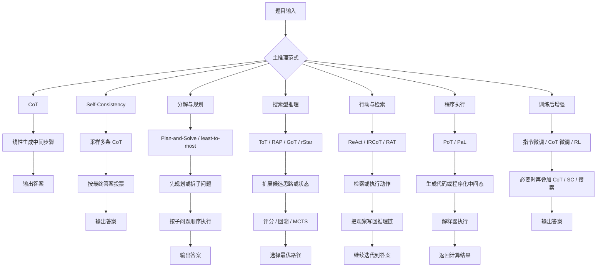

# 单智能体解题是否存在比 CoT 更强的方法

## 执行摘要

结论是“有，但不是无条件地有”。在单智能体设定下，**比原始 CoT 更强**的方法已经相当多：如果允许更高推理时计算，Self-Consistency、Tree of Thoughts、RAP 与 rStar-Math 往往能明显超过线性 CoT；如果允许外部检索或程序执行，IRCoT、ReAct、RAT、PoT 往往在知识密集或计算密集任务上更可靠；如果允许训练，指令微调、CoT 微调与强化学习路线通常能把上限继续推高。citeturn39view0turn4search0turn5view5turn15view0turn34view0turn18view0turn36view0

但“更强”几乎总是以某种代价为前提：更高的采样/搜索成本、更长上下文、更强的工具依赖，或更昂贵的训练与蒸馏。就**固定延迟、无工具、零训练**这一苛刻设置而言，最稳妥的升级往往不是直接跳到搜索树，而是先用 Self-Consistency、Plan-and-Solve 或 least-to-most 这类“轻量结构化推理”。citeturn4search0turn7view0turn33view1

如果把题型拆开看，答案会更清楚：数学/符号题上，程序执行、搜索和 RL 路线最容易超过 CoT；知识密集型多跳 QA 上，检索交错推理通常优于纯 CoT；开放式写作与长程生成上，RAT、Self-Refine 等多阶段单体方法更有效；而在常识或短推理任务上，复杂搜索未必值得。citeturn35view2turn12view4turn15view1turn31view0turn30view3

## 问题界定与比较框架

本文把“单智能体”限定为：**最终解题过程由一个主求解器驱动**，即使它在推理中调用检索器、解释器、奖励模型、价值函数或环境反馈，也不引入多角色辩论或多代理协商。这一定义下，ReAct、IRCoT、PoT、RAP、rStar-Math 仍可纳入“单智能体解题”范畴；它们更像是“一个求解器 + 外部记忆/工具/搜索器”，而不是多智能体系统。citeturn5view0turn15view0turn34view0turn11view0turn36view0

基线 CoT 的核心优点有三点：把复杂问题拆成中间步骤、给出相对可读的推理链、且能通过少量 exemplar 在大模型中被直接激活；但 CoT 也有明确局限，包括对模型规模敏感、推理路径不保证正确、以及“看起来可解释”并不等于“忠实反映内部计算”。Wei et al. 在原始 CoT 论文中就明确写到，CoT 提供的是“可解释窗口”，但“完整刻画模型支撑答案的计算仍是开放问题”；同时其在大模型上才明显涌现，也意味着服务成本较高。citeturn39view0

因此，本文比较“是否比 CoT 更强”，不只看最终准确率，还按以下维度审视：  
**原理是否引入更强的状态表示、搜索、投票、外部记忆或训练信号；推理流程是否线性、分解式、树式或图式；计算/延迟成本是否可接受；对 prompt 长度与样本示例是否敏感；解释性与可复现性是否良好；在数学、逻辑、常识、编程、开放式任务上的收益是否稳定。** 这也是为什么“同样比 CoT 强”，Self-Consistency、PoT、IRCoT、DeepSeek-R1 与 rStar-Math 的“强法”其实完全不同。citeturn4search0turn34view0turn15view0turn18view0turn36view0

需要提前说明的是：下面的很多结果来自**跨论文**比较，基础模型、prompt、shot 数、温度、工具、语料和 API 版本并不一致，因此应把它们视为“方法趋势证据”，而不是严格 head-to-head 排行。IRCoT 作者在其系统对比表中就明确说明，与同时期系统的对比并非完全 head-to-head。citeturn15view0

## 方法综述与机制比较

从机制上看，近三年单智能体“超越 CoT”的路径大致分成六类：**采样投票、显式分解规划、搜索型推理、行动/检索交错、程序执行、训练后增强**。它们不是互斥关系，很多强方法本质上是叠加：例如 “CoT + Self-Consistency”，或“规划 + 搜索 + 奖励”，又或“指令微调 + 长 CoT + RL + 推理时扩展”。citeturn4search0turn7view0turn11view0turn18view0

CoT 的最近邻升级是 **Self-Consistency**。它不改变 CoT 的“线性推理”骨架，而是把“贪心取一条链”改成“采样多条链并按最终答案投票”，本质上是把 CoT 变成一个近似边际化过程。其优势在于实现简单、适配广、几乎对所有已有 CoT prompt 都能直接套用；代价则是推理成本和延迟接近按采样数线性上涨。Wang et al. 报告它能把 CoT 在 GSM8K、SVAMP、AQuA、StrategyQA、ARC-challenge 等任务上分别提升 **17.9、11.0、12.2、6.4、3.9 个百分点**。citeturn4search0

第二类是 **显式分解/规划**。least-to-most 先把难题拆成更容易的子问题，再顺序求解；Plan-and-Solve 则更强调先“理解并规划”，再执行步骤。二者都试图解决 CoT 里常见的“漏步”问题。least-to-most 的代表性证据不是总分，而是**难度泛化**：在 SCAN 长度划分上，code-davinci-002 用 14 个 exemplar 可达至少 **99%**，而 CoT 仅 **16%**；在 GSM8K 上它整体只比 CoT 小幅提高，但在需要至少 5 步的题上从 **39.07% 提升到 45.23%**，说明它最大的价值是“越过示例难度上限”。Plan-and-Solve 方面，PS+ 在 text-davinci-003 上把 GSM8K 从 **56.4%** 提到 **59.3%**，并在 CommonsenseQA、Last Letter 等任务上都稳定超过 zero-shot CoT。citeturn32view0turn33view1turn7view0turn8view0

第三类是 **搜索型推理**。ToT 把单链转成树，把“下一步思路”视为可扩展节点，并允许中途评估与回溯；RAP 进一步把 LLM 同时当作 agent 与 world model，用 MCTS 在推理空间内搜索高奖励轨迹；GoT 则允许比树更一般的图状依赖与聚合。它们的共同点是：**强于 CoT 的来源不再是“写更多步骤”，而是“探索多个备选状态并保留好状态”**。好处是对组合爆炸、规划、博弈、约束满足和高难数学更有效；代价是推理成本常常高出一个数量级。ToT 论文在 GPT-4 的 Game of 24 上给出极典型的案例：CoT 仅 **4%**，CoT-SC(k=100) 仅 **9%**，ToT(b=1) 已到 **45%**，ToT(b=5) 达 **74%**；作者同时指出 ToT 的 token 成本可达 CoT 的 **5–100 倍**。RAP 则在 GSM8K 上把 CoT 的 **29.4%** 提到 **51.6%**（含 aggregation），并在 Blocksworld 上远超 CoT。GoT 的论文也明确声称，在排序任务上相对 CoT、ToT 的质量分别提升约 **70%**、**62%**，同时比 ToT 降低 **31%+** 成本。citeturn5view5turn11view0turn12view4turn12view3turn29view4

第四类是 **行动/检索交错方法**，代表是 ReAct、IRCoT、RAT。这里“比 CoT 更强”的关键不是搜索，而是**把知识获取变成推理的一部分**。ReAct 在“思考—行动—观察”循环中交替生成 reasoning trace 和 action，适合知识更新、交互环境或多跳查证；IRCoT 则把检索插到 CoT 的每一步，以减少早期事实错误对整条链的污染；RAT 进一步把“初始 CoT”逐步用检索证据修订。对这类方法，应把它们理解为“单智能体 + 外部记忆/环境”而不是“纯闭卷思考”。在 HotpotQA/FEVER 上，ReAct 单独并不总能赢 CoT，但与 CoT-SC 组合后能达到更好结果；IRCoT 在 HotpotQA、2WikiMultihopQA、MuSiQue 上都有明显收益，并显著减少 factual error；RAT 在长程代码生成、数学推理、创意写作和 embodied planning 上分别带来平均 **13.63%、16.96%、19.2%、42.78%** 的相对提升。citeturn5view0turn15view1turn15view2turn31view0

第五类是 **程序执行型方法**，典型是 **PoT**。它不是去“让语言模型更会算”，而是**把算术/符号运算从语言模型中拿出来**，交给 Python/SymPy 等解释器完成。Chen et al. 在 TMLR 版本中强调 PoT 相对 CoT 的平均性能提升约 **12%**；在 few-shot Codex 上，GSM8K 从 CoT 的 **63.1%** 提高到 PoT 的 **71.6%**，PoT+SC 到 **80.0%**；在 GPT-4 few-shot 上，GSM8K 从 **92.0%** 提高到 **97.2%**，AQuA 从 **72.4%** 提到 **84.4%**。但作者也明确指出，PoT 更适合数值/符号推理，不一定适合 StrategyQA 这类语义常识任务，而且需要受限执行环境来避免危险代码。citeturn34view0turn35view2turn35view3

第六类是 **训练后增强**，包括指令微调、CoT 微调、软提示优化、以及强化学习。这里“比 CoT 更强”往往不是推理流程本身改变，而是模型本体更适合长推理。FLAN 系列的重要发现是：**普通 instruction tuning 可能伤害推理，但在指令微调中加入少量 CoT 数据可恢复并放大 held-out reasoning 能力**；作者报告 Flan-PaLM + CoT + SC 在 GSM8K 上达到 **83.9%**，但同时明确指出 GSM8K 训练集已进入 instruction-tuning mixture，因此这不是干净的 held-out 结果。到 2025 年，SoftCoT 这类参数高效路线试图在不破坏大模型原有能力的前提下，用“软思维 token”增强推理，LLaMA-3.1-8B-Instruct 上 GSM8K 从 zero-shot CoT 的 **79.61** 提到 **81.03**，StrategyQA 从 **65.63** 提到 **69.04**；相反，ICLR 2025 的 Dynamic Prompt Corruption 则指出**vanilla prompt tuning 在复杂推理上收益很有限，甚至会退化**，DPC 只是相对 vanilla prompt tuning 再提升 **4%–8%**。citeturn24view0turn24view2turn38view3turn27search0

最强的一支训练后路线是 **RL/策略搜索**。DeepSeek-R1 把“长 CoT、反思、自校验”通过 RL 激励出来，而不是仅靠 prompt 触发；其摘要页和 HTML 版报告，DeepSeek-R1-Zero 在 AIME 2024 pass@1 上从 **15.6%** 涨到 **71.0%**，多数投票到 **86.7%**；DeepSeek-R1 本体在 AIME 2024 为 **79.8%**，MATH-500 为 **97.3%**。更激进的 rStar-Math 则把 MCTS、代码验证、过程偏好模型和自进化结合起来：Qwen2.5-Math-7B 在 MATH 上可从 **58.8%** 提到 **89.4%**，64 轨迹时到 **90.0%**；AIME 2024 平均可解 **53.3%**（8/15）。这些结果已经说明，在高难数学上，**训练后增强 + 推理时扩展**通常远强于原始 CoT。citeturn18view0turn19view0turn19view2turn36view0

下表把这些方法按核心取舍压缩到一个比较矩阵中。

| 方法 | 核心机制 | 推理流程 | 计算/延迟成本 | 对提示/样本长度依赖 | 可解释性 | 鲁棒性与泛化 | 更适合的题型 | 是否需要工具/训练 |
|---|---|---|---|---|---|---|---|---|
| CoT | 线性中间步骤 | 单链展开 | 低到中 | 对 exemplar 质量较敏感；大模型更有效 | 较高，但非完全忠实 | 对长链、漏步和算错较脆弱 | 数学、符号、部分常识 | 否 / 否（Wei et al., 2022） citeturn39view0 |
| Self-Consistency | 多链采样 + 答案投票 | 多次 CoT 后聚合 | 中到高，近似随采样数线性增加 | 依赖可采样出正确答案簇 | 中等 | 对随机性更稳，但成本上升 | 数学、符号、常识 | 否 / 否（Wang et al., 2023） citeturn4search0 |
| least-to-most | 先分解再顺序求解 | 两阶段分解/求解 | 中 | 分解 prompt 设计很关键 | 高 | 对“难于示例”的泛化更好 | 长步骤数学、组合泛化 | 否 / 否（Zhou et al., 2023） citeturn32view0turn33view1 |
| Plan-and-Solve | 先规划后执行 | 两阶段规划/执行 | 低到中 | 比 zero-shot CoT 更依赖任务说明 | 高 | 主要缓解漏步 | zero-shot 数学、常识、符号 | 否 / 否（Wang et al., 2023） citeturn7view0turn8view0 |
| ToT / GoT | 分支搜索与状态评估 | 树/图搜索、回溯 | 高到很高 | 对搜索深度、宽度、评分 prompt 敏感 | 中到高 | 对组合爆炸更强 | 规划、博弈、难数学 | 否 / 否（Yao et al., 2023；Besta et al., 2024） citeturn5view5turn29view4 |
| ReAct | 推理 + 行动 + 观察 | Thought-Act-Obs 循环 | 中到高 | 依赖动作模板 | 中等 | 对知识更新和环境互动更稳 | 多跳 QA、环境任务 | 常需要检索/环境 / 否（Yao et al., 2023） citeturn5view0 |
| IRCoT / RAT | 每步检索修正思路 | 检索与 CoT 交替 | 中到高 | 依赖检索质量与语料覆盖 | 中等 | 知识密集型更稳、幻觉更少 | 多跳知识 QA、长程生成 | 是 / 否（Trivedi et al., 2023；Wang et al., 2024） citeturn15view0turn15view1turn31view0 |
| PoT | 把计算交给解释器 | 生成程序并执行 | 中 | 需要程序化示例或指令 | 高 | 数值计算显著更稳 | 数学、财务、符号 | 是 / 否（Chen et al., 2023） citeturn34view0turn35view2 |
| 指令微调 / CoT 微调 | 用训练分布内化推理模板 | 单次前向，可叠加 CoT | 训练高，推理低 | 依赖数据质量 | 中等 | 对 held-out reasoning 可明显改善 | 多数任务，尤其数学/逻辑 | 否 / 是（Chung et al., 2024） citeturn24view2 |
| Prompt tuning / SoftCoT | 软提示或软思维 token | 训练少量参数后推理 | 训练低到中，推理低到中 | 对 backbone/投影设计敏感 | 中等 | vanilla PT 对复杂推理常不稳；SoftCoT 更稳 | 需要 PEFT 的场景 | 通常否 / 是（Fan et al., 2025；Xu et al., 2025） citeturn27search0turn37view0turn38view3 |
| RL / 策略搜索 | 用奖励学习长推理；可叠加 MCTS | 训练后长推理或搜索 | 训练很高；推理中到高 | 对 reward、数据和 compute 高敏感 | 中等 | 上限最高，但复现门槛高 | 高难数学、代码、复杂推理 | 可选 / 是（DeepSeek-AI, 2025；Guan et al., 2025） citeturn18view0turn36view0 |

## 实证比较

在实证层面，最清晰的模式不是“某一个方法全面统治”，而是**不同方法在不同任务族群里各自压过 CoT**。数学和符号任务对“搜索、投票、程序执行、RL”尤其敏感；知识密集任务对“检索交错推理”尤其敏感；开放式或长期生成任务则更受益于“检索修订”与“自反馈 refinement”。下面按基准类型汇总关键结果。citeturn5view5turn15view0turn34view0turn31view0turn18view0

### 数学与算术基准

| 基准 | 方法 | 基础模型 | 分数 | 计算资源/推理步数 | 备注 | 来源 |
|---|---|---:|---:|---|---|---|
| GSM8K | CoT | LLaMA-33B | 29.4 | 4-shot；单链 | RAP 论文设定 | Hao et al., 2023 citeturn12view4 |
| GSM8K | CoT + SC(10) | LLaMA-33B | 46.8 | 10 条链采样 | 投票聚合 | Hao et al., 2023 citeturn12view4 |
| GSM8K | RAP(10) + aggregation | LLaMA-33B | 51.6 | 10 次 MCTS 迭代 + 聚合 | 明显超过 CoT/SC | Hao et al., 2023 citeturn12view4 |
| GSM8K | Zero-shot CoT | text-davinci-003 | 56.4 | 未指定 | Plan-and-Solve 论文设定 | Wang et al., 2023 citeturn7view0 |
| GSM8K | Zero-shot PS+ | text-davinci-003 | 59.3 | 先规划后执行 | 低成本优于 zero-shot CoT | Wang et al., 2023 citeturn7view0 |
| GSM8K | CoT | code-davinci-002 | 60.87 | 1-shot | 与 least-to-most 对应 prompt | Zhou et al., 2023 citeturn33view1 |
| GSM8K | least-to-most | code-davinci-002 | 62.39 | 1-shot，两阶段 | 在 ≥5 步题上 45.23 vs 39.07 | Zhou et al., 2023 citeturn33view1 |
| GSM8K | Few-shot CoT | Codex 175B | 63.1 | few-shot；greedy | PoT 论文设定 | Chen et al., 2023 citeturn35view2 |
| GSM8K | PoT | Codex 175B | 71.6 | few-shot + 解释器执行 | 数值/程序化更稳 | Chen et al., 2023 citeturn35view2 |
| GSM8K | PoT + SC | Codex 175B | 80.0 | K=40；温度 0.4 | 高于 CoT-SC 78.0 | Chen et al., 2023 citeturn35view2 |
| GSM8K | Flan-PaLM + CoT + SC | Flan-PaLM 540B | 83.9 | instruction-tuned + SC | 但 GSM8K 训练集进入 tuning mixture | Chung et al., 2024 citeturn24view0turn24view2 |

这些结果说明，在**不训练**时，最稳妥的升级路径通常是 “CoT → SC” 或 “CoT → PS/least-to-most”；在**允许工具**时，PoT 往往能进一步抬高数值型成绩；在**允许训练**时，instruction tuning / distillation / RL 会把 prompt-only 方法整体抬升一个层级。citeturn4search0turn7view0turn35view2turn24view0turn18view0

### 更难数学与竞赛数学

| 基准 | 方法 | 基础模型 | 分数 | 计算资源/推理步数 | 备注 | 来源 |
|---|---|---:|---:|---|---|---|
| MATH | Qwen2.5-Math-7B base | 7B | 58.8 | System 1 | rStar-Math 起点 | Guan et al., 2025 citeturn36view0 |
| MATH | rStar-Math | 7B policy + 7B PPM | 89.4 | 8 条搜索轨迹 | MCTS + 代码验证 + PPM | Guan et al., 2025 citeturn36view0 |
| MATH | rStar-Math64 | 7B policy + 7B PPM | 90.0 | 64 条轨迹 | 高推理时计算 | Guan et al., 2025 citeturn36view0 |
| AIME 2024 | DeepSeek-R1-Zero | DeepSeek-V3-Base 派生 | 71.0 pass@1 | 纯 RL 训练后推理 | 训练中从 15.6 提升到 71.0 | DeepSeek-AI, 2025 citeturn18view0turn19view0 |
| AIME 2024 | DeepSeek-R1 | 未指定 | 79.8 pass@1 | 多阶段 SFT + RL | 与 o1-1217 同量级 | DeepSeek-AI, 2025 citeturn19view0turn19view2 |
| MATH-500 | DeepSeek-R1 | 未指定 | 97.3 pass@1 | 多阶段 SFT + RL | 顶级推理模型范式 | DeepSeek-AI, 2025 citeturn19view2turn19view5 |
| AIME 2024 | rStar-Math64 | 7B policy + 7B PPM | 53.3 | 64 条轨迹 | 以 7B 级模型逼近闭源前沿 | Guan et al., 2025 citeturn36view0 |

这一组结果最能说明：**真正大幅超越 CoT 的，不是“把 CoT 写得更花”，而是让模型在训练时学会长推理，或在推理时进行显式搜索。** 代价也最明显：rStar-Math 需要多轮自进化和大量 MCTS 轨迹，DeepSeek-R1 需要重型 RL/SFT 流水线。对大多数实际系统，这类方法属于“能力上限路线”，不是“低成本 default”。citeturn36view0turn18view0

### 逻辑、符号与多跳知识基准

| 基准 | 方法 | 基础模型 | 分数 | 计算资源/推理步数 | 备注 | 来源 |
|---|---|---:|---:|---|---|---|
| Last Letter L=12 | CoT | code-davinci-002 | 31.8 | few-shot | 长度泛化较差 | Zhou et al., 2023 citeturn33view3 |
| Last Letter L=12 | least-to-most | code-davinci-002 | 74.0 | 两阶段 | 长度泛化显著更强 | Zhou et al., 2023 citeturn33view3 |
| SCAN length split | CoT | code-davinci-002 | 16% | 14 exemplars | 组合泛化差 | Zhou et al., 2023 citeturn32view0 |
| SCAN length split | least-to-most | code-davinci-002 | ≥99% | 14 exemplars | 组合泛化极强 | Zhou et al., 2023 citeturn32view0 |
| CommonsenseQA | Zero-shot CoT | text-davinci-003 | 65.2 | 未指定 | PS 论文设定 | Wang et al., 2023 citeturn8view0 |
| CommonsenseQA | Zero-shot PS+ | text-davinci-003 | 71.9 | 未指定 | 先规划可稳步提升 | Wang et al., 2023 citeturn8view0 |
| StrategyQA | Zero-shot CoT | text-davinci-003 | 63.8 | 未指定 |  | Wang et al., 2023 citeturn8view0 |
| StrategyQA | Zero-shot PS+ | text-davinci-003 | 65.4 | 未指定 | 提升有限但稳定 | Wang et al., 2023 citeturn8view0 |
| ProntoQA | CoT | 未指定 | Pred 87.8 / Proof 64.8 | 未指定 | 逻辑证明链较脆弱 | Hao et al., 2023 citeturn12view2 |
| ProntoQA | RAP | 未指定 | Pred 94.2 / Proof 78.8 | MCTS | 搜索与奖励帮助证明正确性 | Hao et al., 2023 citeturn12view2 |
| HotpotQA | CoT | PaLM-540B | 29.4 EM | 单链 | ReAct 略低于 CoT | Yao et al., 2023 citeturn5view0 |
| HotpotQA | ReAct→CoT-SC | PaLM-540B | 35.1 EM | ReAct 后再 SC | 该表最佳 | Yao et al., 2023 citeturn5view0 |
| FEVER | CoT | PaLM-540B | 56.3 Acc | 单链 |  | Yao et al., 2023 citeturn5view0 |
| FEVER | CoT-SC→ReAct | PaLM-540B | 64.6 Acc | 检索+推理+投票 | 该表最佳 | Yao et al., 2023 citeturn5view0 |
| HotpotQA | IRCoT QA | GPT-3 | 49.3 EM / 60.7 F1 | 逐步检索 | 优于 ReAct опублик数字 | Trivedi et al., 2023 citeturn15view0 |
| 2WikiMultihopQA | IRCoT QA | GPT-3 | 57.7 EM / 68.0 F1 | 逐步检索 |  | Trivedi et al., 2023 citeturn15view0 |
| MuSiQue 2-hop | IRCoT QA | GPT-3 | 34.2 EM / 43.8 F1 | 逐步检索 | 当时 SOTA 级 | Trivedi et al., 2023 citeturn15view0 |

这组结果揭示出一个重要结论：**对知识密集型推理，CoT 的短板往往不是“不会推”，而是“第一步就基于错事实开推”。** IRCoT 的价值就在于把检索插进每一步；作者报告它相对 one-step retrieval 在 Flan-T5-XXL 上分别带来 HotpotQA **+9.4**、2Wiki **+15.3**、MuSiQue **+5.0** F1 的改进，并且把 factual error 在 HotpotQA/2Wiki 上相对 OneR 分别减少约 **50%/40%**。citeturn15view1turn15view2

### 编程与开放式长程生成

很多经典 CoT 论文并没有系统报告 HumanEval，因此“编程”上的证据更多来自**程序执行、检索修订、RL 推理模型**而不是原始 CoT 系列。HumanEval 官方论文将其定义为从 docstring 合成程序的功能正确性评测集；原始 Codex 在该基准上 pass@1 为 **28.8%**，GPT-3 为 **0%**，说明代码任务对模型训练分布和推理机制都很敏感。citeturn21search8turn21search2

在单智能体方法里，与 CoT 最相关的两条线分别是 **PoT/程序执行** 与 **RL reasoning model**。PoT 通过程序化中间态把数值与逻辑计算外包给解释器，天然适合“要算、要验证、要执行”的程序性任务；而 DeepSeek-R1 系列则证明，RL 诱导出的长推理也能转化为更强的代码竞赛表现，DeepSeek-R1-Distill-Qwen-32B 在 LiveCodeBench 上为 **57.2%**。另一方面，RAT 在长程代码生成上的平均相对提升为 **13.63%**，说明对需要外部知识、库文档和长链修订的代码生成，逐步检索修订比“一次性 CoT”更有优势。citeturn34view0turn19view0turn31view0

对于开放式任务，Self-Refine 值得单列。它并不改变模型结构，也不增加外部工具，而是让**同一个模型为自己的初稿生成反馈，再基于反馈反复修改**。NeurIPS 2023 版本报告在 7 类任务上的平均绝对提升约 **20%**。这类方法提示我们：在开放式写作、解释、长程规划中，“比 CoT 更强”的路径有时不是更复杂的搜索，而是让单体模型拥有**反馈回路**。citeturn30view3

下图展示了搜索型方法强于 CoT 的一个最经典案例：GPT-4 在 Game of 24 上，ToT 的成功率远高于线性 CoT；但成本也更高。citeturn5view5

<svg viewBox="0 0 640 320" width="100%" role="img" aria-label="Game of 24 上 CoT、CoT-SC 与 ToT 的成功率比较柱状图">
  <rect x="0" y="0" width="640" height="320" fill="white"/>
  <text x="320" y="26" text-anchor="middle" font-size="18">Game of 24 成功率对比</text>
  <line x1="70" y1="280" x2="600" y2="280" stroke="black"/>
  <line x1="70" y1="50" x2="70" y2="280" stroke="black"/>
  <text x="55" y="285" text-anchor="end" font-size="11">0</text>
  <text x="55" y="229" text-anchor="end" font-size="11">20</text>
  <text x="55" y="173" text-anchor="end" font-size="11">40</text>
  <text x="55" y="117" text-anchor="end" font-size="11">60</text>
  <text x="55" y="61" text-anchor="end" font-size="11">80</text>
  <line x1="65" y1="224" x2="600" y2="224" stroke="#ddd"/>
  <line x1="65" y1="168" x2="600" y2="168" stroke="#ddd"/>
  <line x1="65" y1="112" x2="600" y2="112" stroke="#ddd"/>
  <line x1="65" y1="56" x2="600" y2="56" stroke="#ddd"/>

  <rect x="100" y="269" width="80" height="11" fill="#6b7280"/>
  <rect x="220" y="255" width="80" height="25" fill="#6b7280"/>
  <rect x="340" y="154" width="80" height="126" fill="#6b7280"/>
  <rect x="460" y="73" width="80" height="207" fill="#6b7280"/>

  <text x="140" y="295" text-anchor="middle" font-size="12">CoT</text>
  <text x="260" y="295" text-anchor="middle" font-size="12">CoT-SC</text>
  <text x="380" y="295" text-anchor="middle" font-size="12">ToT b=1</text>
  <text x="500" y="295" text-anchor="middle" font-size="12">ToT b=5</text>

  <text x="140" y="262" text-anchor="middle" font-size="12">4%</text>
  <text x="260" y="248" text-anchor="middle" font-size="12">9%</text>
  <text x="380" y="147" text-anchor="middle" font-size="12">45%</text>
  <text x="500" y="66" text-anchor="middle" font-size="12">74%</text>
</svg>

图中数值来自 ToT 原论文在 **GPT-4 / Game of 24** 上的主表：IO 为 **7.3%**、CoT 为 **4.0%**、CoT-SC(k=100) 为 **9.0%**、ToT(b=1) 为 **45%**、ToT(b=5) 为 **74%**；同文还报告 ToT 每题约 **5.5k** completion tokens、**$0.74**，而 CoT best-of-100 约 **6.7k** completion tokens、**$0.47**。这说明搜索确实能“买到性能”，但不是免费午餐。citeturn5view5

## 优劣分析与适用场景建议

如果问题是“单智能体有没有比 CoT 更强的方法”，答案是肯定的；如果问题是“有没有一个**在所有任务和所有预算约束下**都比 CoT 更强的方法”，答案是否定的。**CoT 的真正对手不是某一个方法，而是一整套按成本递增的增强谱系。**citeturn39view0turn4search0turn5view5turn18view0

在**低成本、零训练、无外部工具**的场景，最推荐的第一升级通常是 **Self-Consistency**。它几乎不需要改 prompt，只需改解码与聚合，就能在许多数学/符号/常识任务上稳定胜过单链 CoT。缺点是收益和采样预算高度耦合；如果预算只有 2–3 条链，收益可能有限，如果预算上到 20–40 条链，延迟和费用会迅速上涨。citeturn4search0turn35view2

在**零训练但题目步骤很长、容易漏步**的场景，**Plan-and-Solve** 与 **least-to-most** 往往比 SC 更划算。PS/PS+ 适合 zero-shot 下快速增强稳定性；least-to-most 更适合“题目难度超过示例难度”的情况，尤其是组合泛化与长步骤数学。它们的共同风险在于：**分解 prompt 的跨域泛化并不好**。least-to-most 论文明确指出，分解提示往往难以跨域迁移，甚至同域内也可能需要专门设计。citeturn7view0turn33view1turn32view0

在**需要规划、搜索、回溯**的任务上，例如 Game of 24、方块世界、复杂定理推导、竞赛数学，**ToT / RAP / rStar-Math** 通常是真正意义上的“比 CoT 强”。这不是因为它们“解释得更长”，而是因为它们保留了**多个候选状态**，允许失败、允许回退、允许评估未来。若任务存在分支选择或局部错误不可逆，线性 CoT 非常容易走死。代价则是：复杂得多的工程实现、对启发式/奖励设计敏感、以及非常高的推理开销。对于线上服务，除非任务价值高且吞吐压力不大，否则往往需要谨慎部署。citeturn5view5turn11view0turn36view0

在**知识密集型、多跳事实型、时间敏感型**任务上，纯 CoT 往往不应该是主方法。这里最优先的单智能体增强一般是 **ReAct / IRCoT / RAT**。这类方法强的不是“逻辑更复杂”，而是把“找证据”纳入了推理。尤其 IRCoT 的结果表明，只做一次检索不够，很多错误会在后续步骤继续累积；把检索交错到每一步，能显著减少早期事实错误造成的链式崩塌。若任务答案依赖最新外部知识，**外部工具几乎是必要的，不是可选项**。citeturn5view0turn15view1turn15view2

在**数值计算、财务问答、公式推导、可执行中间态**任务上，**PoT** 往往比任何纯文本 CoT 更合理。因为这类任务的瓶颈常常不是理解，而是“算错”或“表达循环/方程太困难”。PoT 把这部分剥离给解释器，是结构性优势。它的必要前提是有一个安全、受限的执行沙箱；没有安全执行环境，就很难在生产上放心使用。citeturn34view0turn35view2

在**能力上限导向**的场景，尤其高难数学和代码，**训练后增强**已经展示出远超 prompt-only 的潜力。FLAN 式 CoT instruction tuning、OpenMathInstruct/WizardMath 类数学微调、以及 DeepSeek-R1 / rStar-Math 的 RL-或搜索增强路线，都表明“把推理模板与长链策略学到参数里”可以把系统推到一个新层级。问题在于，这类路线的**训练成本、数据质量、奖励设计与复现门槛**远高于 prompt engineering。它们适合作为模型建设路线，不适合作为“一句 prompt 就能得到”的战术升级。citeturn24view2turn22search4turn16search2turn18view0turn36view0

如果要给出一个简洁的场景建议，可以概括为下表。

| 任务场景 | 最优先考虑的方法 | 为什么 | 何时不值得 |
|---|---|---|---|
| 低预算、快速提升 CoT | Self-Consistency | 改动最小，收益常最稳 | 延迟预算极紧时 | 
| zero-shot 长步骤题 | Plan-and-Solve / PS+ | 先规划可减漏步 | 题目本身很短时 |
| 超过示例难度上限的题 | least-to-most | 显式分解改善 easy-to-hard 泛化 | 分解模块难设计或跨域时 |
| 组合规划/难数学 | ToT / RAP / rStar | 搜索与回溯比单链更强 | 吞吐和成本受限时 |
| 多跳事实 QA / 最新知识 | IRCoT / ReAct / RAT | 把检索融入每一步推理 | 无高质量检索语料时 |
| 数值/符号/财务计算 | PoT | 解释器比语言模型更会“算” | 无安全执行沙箱时 |
| 自建高性能推理模型 | 指令微调 / CoT 微调 / RL | 上限最高，可持续迭代 | 数据、算力、评估不足时 |

## 可复现的实验验证清单

为了把“方法比较”落到可复现层面，建议把实验分成三组：**纯提示组、工具增强组、训练后增强组**。这样既能回答“是否比 CoT 更强”，也能量化“强多少、贵多少、靠什么强”。下面给出一份可直接执行的验证清单。涉及数据集与官方实现时，优先采用原论文或官方仓库发布版本；其中 GSM8K 是 8.5K 道小学数学题，MATH 为 12,500 道竞赛数学题，HumanEval 为 OpenAI 官方提供的程序合成功能正确性评测。citeturn20search0turn20search4turn21search0turn21search2turn21search8

| 组件 | 纯提示组 | 工具增强组 | 训练后增强组 |
|---|---|---|---|
| 数据 | GSM8K、SVAMP、StrategyQA、Last Letter、HotpotQA、2WikiMultihopQA、MuSiQue；可选 BBH、HumanEval | GSM8K、SVAMP、FinQA、HotpotQA、MuSiQue、开放式长程代码/写作任务 | GSM8K、MATH 或 MATH-500、AIME 2024、StrategyQA、LiveCodeBench / HumanEval |
| 模型 | 开源统一 backbone 为佳，如 LLaMA-3.1-8B-Instruct 或 Qwen2.5-7B-Instruct；若复现原论文，可分别使用 code-davinci-002 / text-davinci-003 / PaLM（若不可得则标注替代模型） | 同上，但增加 BM25 / dense retriever、Wikipedia 语料、Python/SymPy 解释器 | 公开 checkpoint 如 Flan-T5/Flan-PaLM 替代、OpenMathInstruct 模型、DeepSeek-R1-Distill 系列；若自训，记录底座模型与训练数据 |
| 方法 | Direct、Zero-shot CoT、Self-Consistency、Plan-and-Solve、least-to-most、ToT | ReAct、IRCoT、RAT、PoT；可加入 ReAct→CoT-SC 或 PoT+SC | 指令微调、CoT 微调、SoftCoT、DPC、RL/蒸馏模型；可叠加 CoT/SC |
| Prompt | 统一系统提示；每种方法单独模板；保留 exact prompt 文本；few-shot 时固定 exemplar；zero-shot 时固定触发词 | 记录检索模板、action schema、observation 格式、程序白名单模块 | 记录训练指令模板、是否含 rationale、是否含拒答/对齐数据 |
| 解码 | temperature、top-p、max tokens、stop tokens 全部固定；SC 记录 k；ToT 记录深度 d、宽度 b；RAP/rStar 记录 rollouts/MCTS iterations | 检索 top-k、段落截断长度、重排序器、程序执行超时、异常重试策略 | 训练 batch size、lr、epoch、LoRA rank、warmup、RL 算法与 reward；若未披露则记“未指定” |
| 评估 | 准确率、EM、F1、pass@1；再加平均输入 token、输出 token、每题 wall-clock time、失败率 | 同左，再加检索 recall、工具调用次数、执行成功率、事实错误率 | 同左，再加训练算力、训练 token、推理时思维长度分布 |
| 置信度 | 每个配置至少 3 次随机种子；SC/搜索型报告均值与方差 | 检索语料版本固定；避免 corpus 漂移 | checkpoint 固定 hash；评估脚本固定 commit |
| 复现实务 | 使用官方代码优先：Plan-and-Solve、PoT、GoT、RAP、DeepSeek-R1/SoftCoT 均已有公开实现或代码链接 | 统一 Wikipedia dump 日期；Python 环境锁定依赖版本 | 训练数据去重、提示泄漏检查；为 GSM8K/BBH/HotpotQA 保留独立验证集 |

如果要以**最小成本**复现一组有说服力的结论，建议优先做这三项：

| 最小复现实验 | 目标 | 推荐设置 | 预期可验证结论 |
|---|---|---|---|
| CoT vs SC vs PS+ on GSM8K | 检验“轻量结构化升级是否稳健” | 统一 Qwen2.5-7B-Instruct；0/1-shot；SC 的 k=20；PS+ 按原文模板 | SC 与 PS+ 通常都高于单链 CoT，但 SC 更贵、PS+ 更便宜 |
| CoT vs IRCoT on HotpotQA | 检验“知识密集型任务是否必须检索交错” | Wikipedia + BM25；固定 top-k=5；统一 reader | IRCoT 通常比纯 CoT/one-step retrieval 更稳，尤其 F1 与 factuality |
| CoT vs PoT on GSM8K/SVAMP | 检验“计算外包是否能系统性胜过纯文本推理” | Python/SymPy 沙箱；禁用危险模块；统一 few-shot exemplars | PoT 在数值计算题上通常高于 CoT，且错误类型从“算错”变为“程序生成错” |

严格可复现还需要两条“反作弊”规范。第一，**不得为不同方法暗中使用不同 backbone**；若必须使用不同 backbone，应把“模型差异”与“方法差异”分开报告。第二，**必须同时报告正确率与推理成本**，否则 ToT、RAP、SC、rStar 这类方法很容易因为只报准确率而显得“无条件更强”。ToT 原论文的成本表就是一个很好的示范。citeturn5view5

## 结论与未来研究方向

回到原问题：**单智能体解题方面，确实存在不少比 CoT 更强的方法。** 但更准确的说法是：  
**CoT 是“线性思路显式化”的起点；真正超越它的方法，分别从投票、分解、搜索、检索、程序执行与训练后优化六个方向补上了它的短板。**citeturn39view0turn4search0turn7view0turn15view0turn34view0turn18view0

若按“性价比”排序，最值得优先考虑的三条路线是：  
**CoT → Self-Consistency**，适合低工程改动；  
**CoT → Plan-and-Solve / least-to-most**，适合复杂但仍想控成本的长步骤题；  
**CoT → IRCoT / PoT**，适合知识密集或计算密集任务。  
若按“能力上限”排序，则往往是 **搜索型推理** 与 **RL/蒸馏推理模型** 最强，但也是最贵、最难复现。citeturn4search0turn33view1turn15view1turn35view2turn36view0turn18view0

未来研究最值得关注的方向，大致有五个。第一，**把搜索做得更节制**：不是一味增加 rollouts，而是让模型知道“何时该搜索、何时直接答”。第二，**让工具使用更内生**：检索、代码执行、计算器与环境交互不应是外挂脚本，而应与推理状态统一建模。第三，**把过程监督做得更可信**：当前不少强化学习/过程奖励路线仍然强依赖 noisy reward 或难以验证的长链。第四，**改进忠实可解释性**：能看见长 CoT 并不等于真正理解模型内部决策，这仍是开放问题。第五，**统一成本—性能评测**：未来论文应像 ToT 一样同时报告准确率、解码步数、token 成本与时延，否则很难判断“比 CoT 更强”到底是方法优势，还是单纯用了更多推理预算。citeturn5view5turn11view0turn18view0turn39view0

综合来看，如果把“更强”定义为“在可接受成本内得到更高、也更稳的正确率”，那么今天最合理的判断不是“CoT 已过时”，而是：**CoT 仍是单智能体推理的基础接口，但真正领先的方法，已经普遍是 CoT 的结构化、工具化、搜索化或训练化版本。** 在这个意义上，近三年的研究结论非常明确：**答案不是离开 CoT，而是超越“单链、单样本、闭卷、无反馈”的原始 CoT。** citeturn39view0turn4search0turn5view5turn15view0turn34view0turn18view0