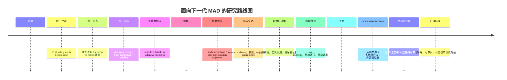
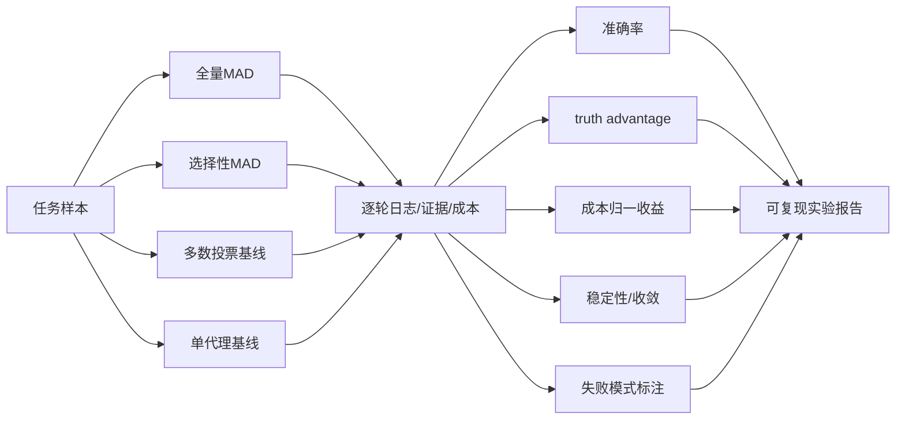

# 多智能体辩论机制创新研究报告

## 执行摘要

近五年内，**LLM 时代的多智能体辩论研究从“是否有效”迅速转向“为何有效、何时失效、如何省算、如何防操纵”**。从正式发表的顶会/顶刊主线看，真正把 MAD 推入主舞台的是 2024 年：ICML 2024 同时出现了并行多智能体辩论、系统性基准比较、可扩展安全辩论与“更会说服的辩手”四条主线；ICLR/NeurIPS 2024 则进一步把 MAD 推向**裁判型评估、多样性机制、形式化理论与弱监督监督协议**。到 2025–2026，研究重点明显转向**多样性注入、效率门控、裁判稳定性检测、角色分配与透明偏差检测**。citeturn9search8turn47view2turn14search1turn30view0turn45view0turn9search6turn15search0turn9search11turn30view1turn10search8turn13view0turn10search18turn10search7turn43view0

当前证据说明：**MAD 不是“多代理越多越好”的通用银弹**。一方面，多篇顶会论文表明，MAD 的提升很大一部分其实来自**初始答案的集成/投票**，而不一定来自多轮交互本身；在七个代表性基准上，Majority Voting 往往与完整 MAD 持平，而多方辩论在相似代理、相似错误和共享误解下，会出现“静态收敛”或“回音室效应”。另一方面，**多样性机制**（不同 persona、不同推理策略、不同模型族、剪枝与反误解干预）在理论和实验上都显示出更高的改进潜力。citeturn47view2turn11view2turn11view3turn35view0turn34view3turn45view0turn33view0

从机制设计视角看，现阶段 MAD 研究最有价值的创新不在“让代理多说几轮”，而在五类机制：**信息不对称与证据验证机制、角色/顺序分配机制、裁判聚合与早停机制、多样性诱导机制、以及成本感知的选择性触发机制**。例如，弱裁判监督强代理的辩论在信息不对称抽取式任务上优于 consultancy；“Truth Last / MADC” 表明角色顺序能够显著影响收敛；iMAD 通过先做单代理自我批判、再判断是否值得触发辩论，将 token 降低到原来的很小一部分；面向 LLM judge 的自适应稳定性检测则把“辩论轮数”从固定超参数变成了统计决策问题。citeturn25view0turn25view1turn12view0turn12view1turn12view3turn11view4turn13view0

面向后续研究，我的核心判断是：**短期应优先做“成本—收益—风险”统一评估；中期应把 MAD 从 prompt engineering 推进到机制设计；长期应把 MAD 与可验证证据、形式论证、工具调用和人类监督融合，发展成可审计的 deliberative AI protocol，而不是单纯的多轮对话模板。** 具体来说，下一阶段最值得投入的方向包括：  
其一，建立**误差相关性可测、可控、可下注释的 benchmark**，把“代理多样性”从经验启发提升为可量化变量；  
其二，建立**抗操纵目标函数**，从 judge accuracy 扩展到 truth advantage、worst-case risk 和稳定性；  
其三，研究**动态拓扑、稀疏通信、分层裁判与 selective debate**，用同等预算取得高于全量 MAD 的真实收益；  
其四，把**形式论证框架/QBAF/可验证引用/程序验证**接入 MAD，使“辩论结果”可追溯、可复核、可申诉。citeturn36view0turn36view1turn11view2turn11view3turn25view0turn25view3turn43view0turn43view3turn42search0turn42search1

## 检索范围与纳入文献

本报告将文献分成两层。**主纳入集**只包含在用户指定范围内、且与 MAD/AI debate/弱监督监督/多智能体论证机制直接相关的**正式发表顶会/顶刊论文**；**支撑集**则包含对机制设计高度相关的正式论文或综述，如形式论证、说服效用建模、论证型解释与偏差透明化等。基于本次检索结果，**LLM-MAD 的主线论文高度集中在 2024–2026**，而 2020–2022 的相关工作更多来自形式论证与计算说服，它们为信息隐藏、资源约束、效用设计和解释可验证性提供了可直接迁移的机制原型。citeturn41view2turn21view0turn21view1turn40view1turn9search8turn47view2turn14search1turn30view0turn45view0turn9search6turn15search0turn9search11turn30view1turn10search8turn13view0turn10search18turn10search7turn43view0

### 主纳入集

| 题目 | 作者 | 会议/期刊 | 年份 | 核心贡献 | 方法类别 | 开源代码/数据 | DOI / arXiv |
|---|---|---:|---:|---|---|---|---|
| *Improving Factuality and Reasoning in Language Models through Multiagent Debate* | Du et al. | ICML | 2024 | 提出并行多智能体辩论框架，显示数学与策略推理、事实性可提升 | 并行 MAD、共识聚合 | 有官方代码 | PMLR 235 / arXiv:2305.14325 citeturn9search8turn9search4turn9search0 |
| *Should we be going MAD? A Look at Multi-Agent Debate Strategies for LLMs* | Smit et al. | ICML | 2024 | 系统比较 MAD 与 self-consistency/ensemble；指出 MAD 对超参数更敏感，当前并不稳定优于其他 prompting | 基准比较、协议分析 | 有开源库 DebateLLM | PMLR 235 / arXiv:2311.17371 citeturn47view2turn9search1 |
| *Scalable AI Safety via Doubly-Efficient Debate* | Brown-Cohen, Irving, Piliouras | ICML | 2024 | 给出复杂性理论版 debate：诚实方仅需多项式步模拟即可成功，可处理随机系统 | 理论 AI debate、交互证明 | 有形式化证明代码 | PMLR 235 / arXiv:2311.14125 citeturn28search1turn37view0turn28search9 |
| *Debating with More Persuasive LLMs Leads to More Truthful Answers* | Khan et al. | ICML | 2024 | 在弱裁判—强辩手设定下，辩论显著提升非专家与人类判断；无监督优化说服力有助于识真 | AI safety debate、说服训练 | 有代码 | DOI: 10.5555/3692070.3693020 / arXiv:2402.06782 citeturn30view0turn31search0turn31search12 |
| *ChatEval: Towards Better LLM-based Evaluators through Multi-Agent Debate* | Chan et al. | ICLR | 2024 | 用多代理 referee team 做文本评测；证明**角色多样性**是必要机制 | 裁判型 MAD、评估 | 有代码 | ICLR 2024 / arXiv:2308.07201 citeturn45view0turn45view2turn46search0 |
| *Multi-LLM Debate: Framework, Principals, and Interventions* | Estornell, Liu | NeurIPS | 2024 | 形式化分析回音室与共享误解，提出质量剪枝、多样性剪枝、误解反驳三类干预 | 理论+干预 | 代码公开情况不清晰 | DOI: 10.52202/079017-0911 citeturn9search6turn35view0turn34view3 |
| *On scalable oversight with weak LLMs judging strong LLMs* | Kenton et al. | NeurIPS | 2024 | 比较 debate、consultancy 与 direct QA；在信息不对称 extractive QA 中，debate 优于 consultancy | 弱监督监督、信息不对称 debate | 未见官方代码 | DOI: 10.52202/079017-2395 / arXiv:2407.04622 citeturn15search0turn25view0turn25view1turn26view0 |
| *Breaking Mental Set to Improve Reasoning through Diverse Multi-Agent Debate* | Liu et al. | ICLR | 2025 | 提出 DMAD，用不同推理风格打破固定思维定势；在 LLM 和 MLLM 上都优于传统 MAD，且轮数更少 | 多样性注入、persona/prompt design | 有代码 | ICLR 2025 citeturn9search7turn33view0 |
| *Debate Helps Weak-to-Strong Generalization* | Lang et al. | AAAI | 2025 | 将 scalable oversight 与 weak-to-strong 结合；用辩论帮助弱模型从强模型中提取较可信监督 | 监督协议、激励 | 代码未明确 | DOI: 10.1609/aaai.v39i26.34952 / arXiv:2501.13124 citeturn30view1 |
| *Debate or Vote: Which Yields Better Decisions in Multi-Agent Large Language Models?* | Choi, Zhu, Li | NeurIPS | 2025 | 证明多数投票贡献了大部分提升，并把 MAD 建模为 martingale；提出偏向纠错的 targeted intervention | 投票 vs 辩论、理论+实证 | 有代码 | arXiv:2508.17536 citeturn11view1turn11view2turn11view3turn10search0turn10search8 |
| *Multi-Agent Debate for LLM Judges with Adaptive Stability Detection* | Hu et al. | NeurIPS | 2025 | 将 LLM judge 辩论的轮数控制转化为 Beta-Binomial + KS 检测的稳定性停止问题 | 裁判机制、早停 | 有代码 | arXiv:2510.12697 citeturn13view0turn10search5 |
| *iMAD: Intelligent Multi-Agent Debate for Efficient and Accurate LLM Inference* | Fan, Yoon, Ji | AAAI | 2026 | 用单代理自我批判提取 41 个可解释特征，决定是否触发 MAD；大幅降 token 而不降精度 | selective debate、成本门控 | 有代码 | arXiv:2511.11306 citeturn12view3turn11view4turn10search2turn27view1 |
| *Key Decision-Makers in Multi-Agent Debates: Who Holds the Power?* | Zhang et al. | AAAI | 2026 | 发现角色顺序极其关键；Truth Last 与基于路径一致性的 MADC 在多模型、多轮推理中有效 | 角色分配、路径一致性 | 有代码 | arXiv:2511.11040 citeturn12view0turn12view1turn11view5turn10search3turn8view0 |
| *Argumentative Debates for Transparent Bias Detection* | Ayoobi et al. | AAAI | 2026 | 用 argument graph / QBAF 使偏差检测变成透明辩论，并支持人与代理、多代理场景 | 透明裁判、可解释 debate | 有代码 | AAAI 2026 citeturn43view0turn43view3 |

### 支撑集

| 题目 | 作者 | 会议/期刊 | 年份 | 对 MAD 的直接启发 | 开源状态 |
|---|---|---:|---:|---|---|
| *A Fully Rational Account of Structured Argumentation Under Resource Bounds* | D’Agostino, Modgil | IJCAI | 2020 | “资源受限下仍保持理性”是高成本 MAD 的理论先例；对应今天的轮数/预算约束 | 未见代码 citeturn40view2turn41view2 |
| *A Large-Scale Dataset for Argument Quality Ranking* | Gretz et al. | AAAI | 2020 | 提供 30,497 条论证质量数据，可支持“辩论发言质量/说服质量”评价 | 数据公开 citeturn40view0turn41view0 |
| *Multi-Agent Abstract Argumentation Frameworks With Incomplete Knowledge of Attacks* | Herzig, Yuste Ginel | IJCAI | 2021 | 把“不完整攻击关系”“公共公告更新”“对手建模”形式化，直接对应信息隐藏辩论 | 理论为主 citeturn21view0turn22view0 |
| *Argumentative XAI: A Survey* | Cyras et al. | IJCAI Survey Track | 2021 | 总结 dialogue games、子图解释、对话式解释，适合作为 MAD 可解释性的结构骨架 | 综述 citeturn21view1turn22view1 |
| *Machine Learning for Utility Prediction in Argument-Based Computational Persuasion* | Donadello et al. | AAAI | 2022 | 直接讨论 argument-based persuasion 的效用预测，提醒 MAD 不能只看正确率，也要看效用/用户差异 | 未见代码 citeturn40view1turn41view1 |
| *A Little of That Human Touch: Achieving Human-Centric Explainable AI via Argumentation* | Rago | IJCAI | 2024 | 强调 human-centric 指标与 argumentation extraction，可迁移到“可申诉 MAD” | 理论/观点型 citeturn21view2turn22view2 |
| *A Survey on the Feedback Mechanism of LLM-based AI Agents* | Liu et al. | IJCAI Survey Track | 2025 | 明确把 multi-agent feedback 分为协作、对抗、人类反馈三条路线，利于把 MAD 放到更大的 agent feedback 版图中 | 综述 citeturn20search3turn8view3 |
| *The Virtual Lab of AI agents designs new SARS-CoV-2 nanobodies* | Swanson et al. | Nature | 2025 | 不是标准 MAD，但展示了“PI agent + scientist agents + human high-level feedback”的 deliberative 结构，并有代码与数据开放 | 代码/数据开放 citeturn23view0 |

从纳入集可以看出，一条清晰的演化链已经形成：**形式论证/说服/资源约束**提供了机制语义，**2024 年顶会 LLM-MAD**提供了实证入口，**2025–2026**则开始进入真正的机制优化阶段，即多样性、稳定性、效率和可验证性。citeturn41view2turn21view0turn40view1turn9search8turn47view2turn35view0turn25view0turn33view0turn11view2turn13view0turn27view1turn12view1

## 机制创新图谱

```mermaid
flowchart TD
    A[多智能体辩论机制] --> B[对话结构]
    A --> C[信息机制]
    A --> D[裁判与聚合]
    A --> E[激励与目标]
    A --> F[效率机制]
    A --> G[可解释与可验证]

    B --> B1[并行辩论]
    B --> B2[顺序/交替发言]
    B --> B3[角色分配与顺序控制]
    B --> B4[多样persona/多模型异质性]

    C --> C1[隐藏证据与弱裁判]
    C --> C2[公共公告与逐步揭示]
    C --> C3[可验证引用/证据检查]

    D --> D1[多数投票]
    D --> D2[弱LLM judge]
    D --> D3[多代理裁判团]
    D --> D4[稳定性检测与早停]

    E --> E1[truth vs falsehood advantage]
    E --> E2[说服力训练]
    E --> E3[效用预测与个性化]

    F --> F1[投票替代辩论]
    F --> F2[选择性触发]
    F --> F3[动态轮数]
    F --> F4[预算受限协议]

    G --> G1[QBAF/论证图]
    G --> G2[路径一致性]
    G --> G3[human-centric explanation]
```

上图反映的是一个重要事实：**近年的 MAD 创新已经不再局限于“多说几轮”，而是在 protocol 层对信息、裁判、激励和预算进行联合设计**。以 2024–2026 的正式论文为代表，至少有七个值得单独跟踪的机制维度。citeturn9search8turn47view2turn35view0turn25view0turn33view0turn11view2turn13view0turn27view1turn12view1turn43view0

### 关键机制维度比较

| 维度 | 代表方法 | 代表论文 | 优点 | 缺点 | 适用场景 |
|---|---|---|---|---|---|
| 对话结构 | 并行 MAD、tit-for-tat、多裁判团 | Du 2024；ChatEval 2024 citeturn9search8turn45view0 | 易扩展、实现简单、可与黑盒 API 兼容 | 交互机制常与投票效应混淆 | 通用 QA、文本生成评估 |
| 多样性机制 | 异质 persona、不同推理风格、Diversity Pruning | ChatEval 2024；Multi-LLM Debate 2024；DMAD 2025 citeturn45view2turn34view3turn33view0 | 能削弱回音室与共享误解 | 多样性若只停留在人设层，收益不稳定 | 高相关错误、开放题、复杂推理 |
| 信息控制 | judge 不看原文、辩手提证；公共公告更新；局部揭示 | Kenton 2024；Herzig 2021；Brown-Cohen 2024 citeturn25view1turn21view0turn37view0 | 能把“识别真相”问题转成“识别更好证据” | 裁判若缺乏证据校验，容易被操纵 | 抽取式 QA、审校、法务/合规 |
| 裁判机制 | 多数投票、弱 LLM judge、适应性早停 | Debate or Vote 2025；On Scalable Oversight 2024；Adaptive Stability 2025 citeturn11view2turn25view0turn13view0 | 能显式控制一致性、成本与收敛 | 多数投票可能掩盖交互真正价值；judge 有偏差 | 自动评测、模型监督 |
| 激励与目标 | persuasion optimization、truth advantage、效用预测 | Khan 2024；Weak-to-Strong 2025；Donadello 2022 citeturn30view0turn30view1turn40view1 | 把“说服”变成可优化目标 | 目前多数论文仍缺少真正的支付/机制相容设计 | 安全监督、个性化说服、教育医疗 |
| 资源效率 | selective debate、门控、动态轮数 | iMAD 2026；Adaptive Stability 2025；Debate or Vote 2025 citeturn27view1turn13view0turn11view2 | 显著降低 token 和延迟 | 需要额外 gating / stopping 模型 | 生产环境、预算敏感任务 |
| 角色分配 | Truth Last、路径一致性、关键决策者 | Key Decision-Makers 2026 citeturn12view0turn12view1 | 低成本却高影响，直接改变辩论轨迹 | 真实任务中“谁更接近真相”未知 | 多轮推理、合议、专家会诊 |
| 可解释与可验证 | argument graph、QBAF、human-centric explanation | Argumentative XAI 2021；Rago 2024；ABIDE 2026 citeturn21view1turn21view2turn43view0turn43view3 | 结果可追溯、可申诉、可供人工复核 | 工程复杂度更高，接口需要结构化输出 | 高风险应用、监管场景 |

综合比较后，我给出一个明确判断：**最值得继续投入的不是“更长的辩论”，而是“更强的机制”**。如果目标是科研突破，优先级应当是  
一，**多样性与误差相关性控制**；  
二，**裁判机制与可验证证据**；  
三，**成本感知的 selective debate**；  
四，**角色分配和通信拓扑**；  
五，**真正的激励相容/抗操纵分析**。  
原因很简单：前四者已经在正式论文中出现了稳健证据，而第五者目前仍明显不足，反而是未来最有原创性的突破方向。citeturn34view3turn33view0turn25view0turn13view0turn27view1turn12view1turn36view0

## 理论与实证证据

现有顶会主线已经出现了三类理论结果。第一类是**复杂性与交互证明型理论**：Brown-Cohen 等证明，在适当协议设计下，诚实方能够用多项式级模拟完成验证，而且 verifier 对“人类判断/黑盒裁判”的查询数可保持常数级，给 scalable oversight 提供了比原始 debate proposal 更可执行的理论地基。第二类是**Bayesian / stochastic process 型理论**：Estornell 与 Liu 把 debate 建模为潜在概念分布更新过程，指出同质模型与同质回答会导致静态辩论；Choi 等则进一步给出 martingale 视角，说明标准辩论并不会系统性提高期望正确率，因此必须通过偏向纠错的机制打破“零净改进”。第三类是**形式论证/语义性质理论**：从资源受限理性、动态不完全攻击知识，到 QBAF 的渐进语义与偏差检测性质，相关工作提供了“可解释、可验证、可申诉”的形式工具箱。citeturn37view0turn37view1turn35view0turn34view3turn11view1turn11view2turn41view2turn21view0turn43view3

### 理论与实证证据对照

| 论文 | 理论结果 | 基准/环境 | 主要指标 | 对 MAD 研究的含义 |
|---|---|---|---|---|
| Brown-Cohen et al. 2024 | 诚实方可用**多项式步模拟**成功，且可验证随机系统；verifier 对黑盒裁判查询可保持常数级 citeturn37view0 | 理论协议分析 | 复杂度、可验证性 | 证明“可扩展监督式 debate”并非只靠直觉 |
| Estornell & Liu 2024 | 相似能力/相似回答会导致**静态 debate dynamics** 和回音室；剪枝与反误解干预可改进 citeturn35view0turn34view3 | 四个常见 benchmark | 准确率 | 多样性不是装饰，而是机制必要条件 |
| Choi et al. 2025 | MAD 可形式化为 **martingale**；多数投票解释了大部分收益；targeted intervention 才能带来额外提升 citeturn11view1turn11view2turn11view3 | 七个 NLP benchmark | 准确率、投票收益、干预收益 | 先问“要不要辩论”，再问“怎么辩论” |
| Kenton et al. 2024 | 无严格定理，但通过协议比较刻画信息不对称监督；debate 在 extractive QA 中优于 consultancy citeturn25view0turn25view1 | QuALITY、BoolQ、GPQA-extractive、MMLU、GSM8K、PrOntoQA、TruthfulQA、MMMU 等 citeturn25view1 | Judge accuracy、win rate | 信息不对称和证据核验比“多轮对话”本身更关键 |
| Liu et al. 2025 | 无形式证明，但给出“fixed mental set”机制假设；多样性显著优于传统 MAD 且更省轮数 citeturn33view0 | 多个 LLM / MLLM benchmark | 准确率、轮数 | 认知路径去相关是下一代 MAD 的核心变量 |
| Fan et al. 2026 | 用 41 个可解释特征做 debate gating；在 6 个 (V)QA 数据集上**最高降 token 92%，准确率最高增 13.5%** citeturn12view3turn11view4 | 六个 (visual) QA 数据集 | 准确率、token cost | 生产化 MAD 必须是选择性触发，而非全量触发 |
| Zhang et al. 2026 | 角色顺序显著影响性能；Truth Last 的优势达到显著性，且 MADC 用路径一致性近似“真相角色” citeturn12view0turn12view1turn11view5 | 多模型、多轮推理任务 | 准确率、路径一致性、熵、p-value | ranking / ordering 是被严重低估的协议杠杆 |

### 常用评估任务与指标

| 评估家族 | 典型任务/数据 | 为什么重要 | 常用指标 | 当前问题 |
|---|---|---|---|---|
| 隐藏证据型监督 | QuALITY、BoolQ、GPQA-extractive citeturn25view1 | 最接近“弱裁判监督强代理”的真实条件 | Judge accuracy、win rate、证据校验率 | 如果没有证据验证，容易被 rhetoric 误导 citeturn25view1turn30view0 |
| 封闭式推理 | MMLU、GSM8K、PrOntoQA、TruthfulQA、CommonsenseQA、HellaSwag 等 citeturn25view1turn11view2 | 便于大规模比较与 ablation | Accuracy、EM、majority-vote gain | 往往把投票收益和交互收益混在一起 citeturn11view2 |
| 文本评测 / judge | ChatEval 的两个文本评测基准 citeturn45view0 | 测试“多评审—合议—裁判”机制 | 与人类评分的 accuracy / correlation | 裁判偏差与角色提示敏感性高 citeturn45view0turn45view2 |
| 医疗/专业域 | MedQA 等（iMAD 论文示例） citeturn11view6 | 高风险、适合检验成本收益 | 准确率、token cost、成本归一性能 | 需要更强证据可验证和人工复核 |
| 透明偏差检测 | 合成偏差模型、真实数据模型、ChatGPT-4o 评测 citeturn43view0 | 测试辩论是否能兼顾准确与解释 | 检测性能、可解释性 | 当前多用于 classifier fairness，尚未普遍用于 LLM-MAD |
| 机制设计型指标 | ASD、EAS、Expected Judge Score（补充 benchmark） citeturn36view0turn36view1 | 衡量协议是否真正“偏向 truth over falsehood” | ASD、EAS slope、Brier-based score | 尚未成为顶会 MAD 统一标准 |

这里最值得强调的一点是：**judge accuracy 不是充分指标**。如果研究问题是“多代理是否提高答题正确率”，accuracy 当然必要；但如果研究问题是“协议是否激励代理说真话、是否耐受更强操纵者、是否适合高风险监督”，那就必须引入 **truth advantage**、**worst-case risk**、**稳定性** 和 **成本归一表现**。这也是为什么 2025 年的 scalable oversight benchmark 明确批评只看 judge accuracy 的做法，并提出 ASD 作为更接近机制设计目标的指标。citeturn36view0turn36view2turn36view3

同时，统计显著性的报告仍不统一。少数论文主动报告了显著性或置信区间，例如 MADC 对 Truth Last 的比较给出 **p < 0.0001**，Kenton 等在 open-role/open-debate 分析中报告 **95% CIs**；但不少 MAD 工作仍以平均值或单次结果为主。这意味着**该领域还没有形成像 RL 或 classic NLP benchmark 那样成熟的实验规范**。citeturn12view0turn25view3

## 未解决问题与风险

最明显的研究空白，是**“辩论增益”与“集成增益”的识别问题**。当前接受度最高的批判证据来自 Smit 2024 与 Choi 2025：前者指出 MAD 现阶段并不稳定优于 self-consistency 与 ensemble，后者更进一步说明多数投票往往已经解释了大部分提升。换言之，如果不能在设计与评估上把“是否交流”与“是否集成”拆开，那么很多所谓 MAD 进展其实只是更昂贵的投票系统。citeturn47view2turn11view2

第二个核心挑战是**共享误解与协同错误**。Estornell 与 Liu 的理论分析说明，同质能力与相似回答会让 debate 收敛到多数意见；而当多数意见本身来自共享训练偏差时，更多代理只会放大错误。DMAD、ChatEval 与 MADC 的共同启示是：**多样性必须是任务相关的、机制化的，而不能只是表面上的多 persona 装扮**。citeturn34view3turn35view0turn45view2turn33view0turn12view1

第三个现实障碍是**计算复杂度与部署性**。全量 MAD 往往把调用次数放大为“代理数 × 轮数 × 裁判数”，而实际收益并不总是线性增长。iMAD 已经给出强烈信号：并非每个问题都值得启动辩论；Adaptive Stability 进一步表明，也并非每次都应跑满固定轮数。对产业部署而言，**静态 N-agent、T-round 配置将很快被 selective debate + adaptive stopping 取代**。citeturn11view4turn12view3turn13view0

第四个未解问题是**抗操纵性与激励相容性不足**。Khan 2024、Kenton 2024 与 2025 benchmark 一起指出：debate 可以帮助弱裁判识真，但 consultancy 尤其容易被“gaslight”式互动利用；同时，只看 judge accuracy 还会把“说服能力”与“对齐激励”混淆。到目前为止，正式发表的 MAD 论文大多没有真正引入支付函数、真伪可验证奖励或机制相容证明，这意味着“多代理系统在目标不一致时会不会联手骗裁判”仍然是开放问题。citeturn30view0turn25view0turn36view0turn36view1

第五个风险来自**解释性与伦理治理**。如果 MAD 被用于医疗、合规、司法辅助或政策问答，仅仅输出“多数代理认为 A 正确”是远远不够的。论证型解释和 QBAF 类工作表明，用户更需要的是：**谁提出了什么证据、谁攻击了哪个证据、最终裁决基于哪条路径、有哪些局部反例没有被覆盖**。若缺少这类结构化可解释层，MAD 只会把复杂性从单模型转移到“模型群体黑箱”。citeturn21view1turn21view2turn43view0turn43view3

### 开放问题与局限

本报告也有三点需要如实说明。第一，**2024 之前以 LLM-MAD 为名的正式顶会论文非常稀少**，因此 2020–2022 的纵向比较较多依赖形式论证与说服文献，而不是今天意义上的 LLM-MAD。第二，部分 2025–2026 论文虽然已在 OpenReview/会议 proceedings 中显示接收信息，但有些只有 arXiv/OpenReview 版本，正式页码与最终版本可能仍会细微变化。第三，AAMAS 主会近年与 LLM-MAD 直接重叠的正式论文相对有限，因此本报告更多吸收了 IJCAI/AAAI/ICLR/ICML/NeurIPS/Nature 的证据。相关不确定之处我都已在表格和论述中尽量标明。citeturn9search6turn13view0turn19search0

## 未来研究路线图与实验建议

我建议把后续路线图分成三个阶段：  
**短期**聚焦“评估与 protocol hygiene”；  
**中期**聚焦“机制设计与理论可证”；  
**长期**聚焦“可验证 deliberative AI 基础设施”。  
原因是：现阶段最短板不是 ideas，而是 **缺统一 benchmark、缺机制指标、缺可复现实证**；一旦这些打牢，真正有价值的理论与系统创新才容易累积。citeturn36view0turn11view2turn35view0turn27view1turn43view0

### 可操作研究任务与里程碑

| 时段 | 研究任务 | 里程碑 | 为什么优先 |
|---|---|---|---|
| 未来 1 年 | 统一 MAD 报告规范：单代理、投票、全 MAD、selective MAD 四个 baseline 必须同报 | 发布公开评测套件与日志 schema | 先解决“到底是谁带来收益”这一识别问题 citeturn47view2turn11view2 |
| 未来 1 年 | 建立 error-correlation benchmark | 每题标注代理间错误相关度、证据可验证度、误导性强度 | 多样性机制只有在相关错误上才有意义 citeturn34view3turn33view0 |
| 未来 2–3 年 | 建立 ASD / worst-case ASD / stability 的主流评估协议 | 至少一个社区基准采用 truth advantage 作为主指标 | 从“做题”转向“监督协议”评价 citeturn36view0turn36view1 |
| 未来 2–3 年 | 研究 role ordering、层级裁判、动态拓扑 | 在同等 token 下稳定超越 full MAD | 角色分配与成本约束已经有显著实证空间 citeturn12view1turn11view4 |
| 未来 2–3 年 | 接入外部验证器 | 证据引用、代码执行、形式验证成为协议一部分 | 高风险任务需要“辩论 + 验证”而不是单靠口头说服 citeturn25view1turn43view0turn42search0turn42search1 |
| 未来 3–5 年 | 建立可审计 deliberative AI 平台 | 人机共审、多代理合议、审计日志、申诉接口 | 才能进入医疗、法务、政策等高风险应用 citeturn21view2turn43view0turn23view0 |

### 建议的可复现实验

#### 实验一

| 项目 | 设计 |
|---|---|
| 假设 | 在多数标准推理任务上，MAD 的主要增益来自初始集成而非多轮交互；但 selective debate 能在接近或略高精度下显著降低成本 |
| 数据/环境 | GSM8K、MMLU、TruthfulQA、CommonsenseQA、HellaSwag、MedQA；优先使用 Qwen / Llama / DeepSeek-R1-Distill 等开源系模型，采用 vLLM 或 Hugging Face 部署；若需要商用对照，可用 OpenAI Responses API 的 reasoning models 做上界参考 citeturn11view2turn11view6turn42search2turn42search6turn42search3turn42search15 |
| 对照组 | Single CoT；Self-Consistency；Majority Voting；Full MAD；iMAD-like selective MAD |
| 指标 | Accuracy；token cost；accuracy per 1k tokens；轮次边际收益；回答稳定性 |
| 预期结果 | Majority Voting ≈ Full MAD 是常见现象，但 selective MAD 在 cost-adjusted 指标上最优；若任务难且错误相关性高，则 selective MAD > voting > full MAD > single CoT citeturn11view2turn11view3turn11view4 |

#### 实验二

| 项目 | 设计 |
|---|---|
| 假设 | 真正有效的 diversity 不是“不同人设”本身，而是**低错误相关性**与**不同证据路径**；在共享误解较强的问题上，异质模型 + 异质推理风格会显著优于同质 MAD |
| 数据/环境 | 构造“高共享误解”子集：常识陷阱、逻辑谬误、反直觉数学题、误导性上下文样本；此外加入 MLLM 任务测试 DMAD 的跨模态可迁移性 |
| 对照组 | 同模型同 prompt；同模型异 prompt；异模型同 prompt；异模型异 prompt；加入 Multi-LLM Debate 的剪枝/反误解干预 |
| 指标 | Accuracy；pairwise disagreement entropy；语义多样性；错误相关系数；共识速度；失败模式标签 |
| 预期结果 | 同质 MAD 更容易静态收敛；异质推理风格与 diversity pruning 的组合在高相关错误数据上改进最大 citeturn34view3turn35view0turn33view0turn45view2 |

#### 实验三

| 项目 | 设计 |
|---|---|
| 假设 | 在“弱裁判 + 隐藏证据”的监督场景中，带证据校验的 debate 显著优于 consultancy；若再加入稳定性早停，可在保证 truth advantage 的同时控制成本 |
| 数据/环境 | QuALITY、BoolQ、GPQA-extractive、自建代码审查/法规条款审查数据；judge 只见问题与辩论，不见原文；辩手必须给出可验证引用 |
| 对照组 | Direct QA；Consultancy；无证据校验 Debate；有证据校验 Debate；有证据校验 + Adaptive Stopping |
| 指标 | Judge accuracy；ASD；worst-case ASD；证据校验通过率；token cost；错误类型（被 rhetoric 误导、证据遗漏、证据伪造） |
| 预期结果 | Debate > Consultancy 的结论能复现，但只有“可验证证据 + 早停”版本才具备向高风险应用迁移的现实可能性 citeturn25view0turn25view1turn36view0turn13view0 |

### 推荐实验平台与复现标准

第二张建议图不是“某篇论文已有架构”，而是我建议你在课题组或团队里直接采用的**标准化实验流水线**：

建议的复现标准是：**固定模型版本、固定 API snapshot、公开 prompt 模板、公开逐轮 transcript、公开随机种子、公开 token 账本、公开成本统计、公开错误分类规则、报告 bootstrap CI 或置换检验、且必须包含 single/vote/full/selective 四类基线。** 对需要多智能体环境仿真的工作，OpenSpiel 适合做博弈与信息不完全设置，PettingZoo 适合做顺序/并行动作环境；开源模型部署可优先用 vLLM。若采用商用推理模型做上界对照，建议用支持 reasoning tokens 和 structured outputs 的 API，并把“模型 ID、reasoning effort、温度、max output tokens”一并记录。citeturn42search0turn42search1turn42search2turn42search6turn42search3turn42search15

## 指导意见与参考阅读

### 面向学术研究者的建议

如果你是做学术研究，我最建议你**避免把论文贡献停留在新 prompt 模板**。当前领域里最缺、也最容易出高质量论文的，是下面四类 work package。

第一，做**机制识别**而不是只做结果展示。你的论文应该能回答：收益来自投票、来自交互、来自异质性，还是来自证据验证？为此，必须把单代理、vote、full MAD、gated MAD、heterogeneous MAD 一起比较。否则很容易被 2024–2025 主线论文的批判证据“打回去”。citeturn47view2turn11view2

第二，做**误差相关性与共享误解建模**。从创新性上讲，这是目前最肥沃的空白点。你可以把“代理独立性”当成 latent variable，研究不同模型族、不同知识来源、不同工具接入、不同思维风格对错误相关性的影响，并分析它与 MAD 收益的关系；这比单纯增加 agent 数更有学术价值。citeturn34view3turn33view0

第三，做**可验证证据型 MAD**。高影响方向不是“让代理更会说”，而是“让代理必须说出可验证的东西”。这可以是可验证引用、代码执行、定理检查、数据库检索或 external tool grounding。只要你能把“裁判看不懂强模型答案”转成“裁判能审核小块证据”，就站到了 scalable oversight 和 argumentation 的交叉点上。citeturn25view1turn37view0turn43view0

第四，做**理论上可解释的 protocol**。当前最容易投顶会的理论问题包括：error-correlation 下的收益上界；truth advantage 的充分条件；动态角色排序的收敛性；adaptive stopping 的风险保证；以及“何时辩论永远不值得”的判别条件。形式论证和随机过程理论已经给了你可借力的工具。citeturn41view2turn21view0turn11view1turn12view1turn13view0

### 面向产业研发团队的建议

如果你是产业团队，我的建议非常直接：**不要默认使用 full MAD**。在生产环境里，优先选择  
单代理强基线 → 投票集成 → selective debate → 有证据校验的高风险 MAD  
这样的升级路径。因为目前最可靠的证据并不支持“任何任务都该多代理辩论”；相反，它支持“先用便宜方法过滤，再对高不确定、高风险样本启动更强 deliberation”。citeturn11view2turn11view4

具体落地上，建议你把 MAD 只放在三类场景：  
一，**高风险但低吞吐**的审核任务，如医疗质控、政策问答、合规审查；  
二，**证据可核验**的任务，如文档 QA、代码审查、知识库问答；  
三，**需要多视角 deliberation** 的任务，如复杂项目规划、模型评测与 red teaming。对于高吞吐客服、简单双选题和低风险生成任务，vote 或 self-consistency 往往更划算。citeturn25view1turn45view0turn11view2

工程上必须做三层防线：  
第一层，**成本门控**：先做不确定性评估或自我批判，再决定是否触发辩论；  
第二层，**证据门控**：发言若无依据，不进入下一轮或不参与最终投票；  
第三层，**审计门控**：保留 transcript、证据链、模型版本、参数与最终裁决理由。  
这三层分别对应 iMAD、弱监督监督文献和 argumentation/XAI 文献给出的最佳实践。citeturn27view1turn25view1turn21view2turn43view0

### 面向政策制定者与治理机构的建议

对于政策与治理部门，MAD 的关键价值不在“更聪明”，而在**更可审计**。相比单模型输出，多代理 protocol 至少天然提供了异议、反驳与多路径证据，这为监管提供了更好的切入点；但前提是系统必须保留结构化日志，而不是只给最终答案。citeturn21view2turn43view0

因此，政策层面应重点要求三类合规能力。  
其一，**理由可追踪**：最终结论必须能回溯到哪位代理、哪条证据、哪轮反驳。  
其二，**协议可披露**：至少披露 agent 数量、角色设计、是否投票、是否早停、是否使用外部工具。  
其三，**高风险场景强制人类在环**：医疗、司法、公共服务等领域不应把 MAD 当作自动决策替代，而应把它当作“可审计的 deliberation 支持层”。  
这些要求与 human-centric explainability、透明偏差检测和 scalable oversight 的研究方向是高度一致的。citeturn21view2turn43view0turn36view0

### 优先级排序的参考阅读清单

下面给出一个**可执行**的阅读顺序。若你要组会、开题或写综述，建议按这个顺序读。

| 优先级 | 论文 | 为什么先读 |
|---|---|---|
| 最高 | Du et al., *Improving Factuality and Reasoning in Language Models through Multiagent Debate*, ICML 2024 | LLM-MAD 主线起点，理解最经典的并行 MAD 范式 citeturn9search8 |
| 最高 | Smit et al., *Should we be going MAD?*, ICML 2024 | 最重要的系统性“冷水”论文，避免高估 MAD citeturn47view2 |
| 最高 | Choi et al., *Debate or Vote*, NeurIPS 2025 | 解释“为什么 vote 常常已经够了”的关键理论与实证论文 citeturn11view1turn11view2 |
| 很高 | Estornell & Liu, *Multi-LLM Debate*, NeurIPS 2024 | 回音室、共享误解、多样性剪枝的核心理论来源 citeturn35view0turn34view3 |
| 很高 | Kenton et al., *On scalable oversight with weak LLMs judging strong LLMs*, NeurIPS 2024 | 看清“弱裁判监督强代理”的实验范式 citeturn25view0turn25view1 |
| 很高 | Khan et al., *Debating with More Persuasive LLMs Leads to More Truthful Answers*, ICML 2024 | 看清“说服力训练”与 truthful answering 的关系 citeturn30view0 |
| 很高 | Brown-Cohen et al., *Scalable AI Safety via Doubly-Efficient Debate*, ICML 2024 | 获取 debate 的复杂性理论地基 citeturn37view0 |
| 高 | Liu et al., *Breaking Mental Set through Diverse MAD*, ICLR 2025 | 多样性为何有效、如何在更少轮数下有效 citeturn33view0 |
| 高 | Fan et al., *iMAD*, AAAI 2026 | 如果你关心部署，这篇必须读；它基本定义了“生产级 MAD”方向 citeturn11view4turn12view3 |
| 高 | Zhang et al., *Key Decision-Makers in Multi-Agent Debates*, AAAI 2026 | 角色排序与路径一致性，是目前最不“花哨”但很强的机制创新 citeturn12view1turn11view5 |
| 中高 | Chan et al., *ChatEval*, ICLR 2024 | 如果你关心 LLM-as-a-judge，这是最该读的 MAD 论文之一 citeturn45view0turn45view2 |
| 中高 | Ayoobi et al., *Argumentative Debates for Transparent Bias Detection*, AAAI 2026 | 看 MAD 如何走向可解释、透明、可申诉的制度化形式 citeturn43view0turn43view3 |
| 中高 | Herzig & Yuste Ginel, *Multi-Agent AFs with Incomplete Knowledge of Attacks*, IJCAI 2021 | 想做理论，必须补这类动态论证框架基础 citeturn21view0 |
| 中高 | Donadello et al., *Utility Prediction in Argument-Based Persuasion*, AAAI 2022 | 进入机制设计/用户效用建模的桥梁论文 citeturn40view1 |
| 中高 | Cyras et al., *Argumentative XAI: A Survey*, IJCAI 2021 | 帮你把 MAD 接到可解释性与 human-in-the-loop 研究上 citeturn21view1 |

归纳到最后，给你一句最实用的指导意见：**下一波 MAD 的突破，不会来自“再加两个代理”，而会来自“让代理之间的互动成为一个可证明、可验证、可审计、可控成本的机制”。** 如果你的研究能够把**多样性、证据验证、裁判稳定性、truth advantage 和选择性触发**五件事中的任意两件同时做深，基本就已经踩在这个方向的主航道上了。citeturn34view3turn25view1turn13view0turn36view0turn11view4